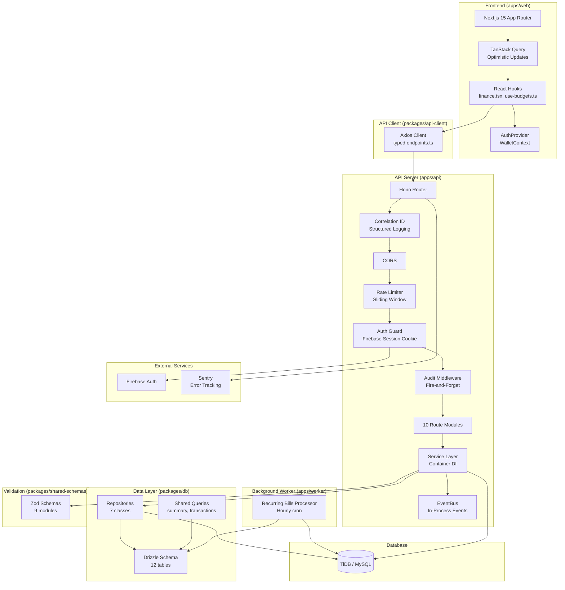

# Finance Tracker — Technical Architecture

This document describes the complete architecture of Finance Tracker V3, generated from the live codebase via knowledge graph and source analysis. Last updated: 2026-05-03.

## Overview

**Finance Tracker** is a personal finance management application built as a **Turborepo + pnpm monorepo**. It tracks income, expenses, budgets, recurring bills, financial goals, and multi-wallet balances with strong financial integrity guarantees.

### Tech Stack

| Layer | Technology |
|-------|-----------|
| Frontend | Next.js 15 (App Router), React, Tailwind CSS v4, shadcn/ui |
| Data Fetching | TanStack Query (React Query v5) with optimistic updates |
| API Server | Hono (Node.js adapter), port 3001 |
| Database ORM | Drizzle ORM |
| Database | MySQL (TiDB Serverless / local MySQL via Docker) |
| Auth | Firebase Auth (session cookie via `jose`) |
| Background Worker | Node.js long-lived process (`apps/worker`) |
| Validation | Zod (shared between API and Web via `packages/shared-schemas`) |
| API Client | Typed Axios-based client (`packages/api-client`) |
| Math | Decimal.js (all monetary arithmetic) |
| Observability | Pino (structured logging), Sentry (error tracking, lazy-loaded) |

## Monorepo Structure

```
finance-for-me-local/
├── apps/
│   ├── api/          # Hono REST API (port 3001)
│   │   └── src/
│   │       ├── index.ts              # App entry, middleware wiring, route mounting
│   │       ├── routes/               # 10 route modules (auth, transactions, bills, goals, ...)
│   │       ├── services/             # Business logic layer (13 services + container)
│   │       │   └── adapters/         # NLP adapter (RegexNLPAdapter for quick-add parsing)
│   │       ├── middleware/           # auth-guard, rate-limit, audit
│   │       └── lib/                  # firebase-auth, jwt, logger, event-bus, response helpers
│   ├── web/          # Next.js 15 dashboard (port 3000)
│   │   └── src/
│   │       ├── app/(dashboard)/      # Pages: transactions, budgets, bills, goals, analytics, wallets, settings
│   │       ├── app/context/          # AuthProvider, WalletContext
│   │       ├── components/           # Reusable UI (dashboard cards, forms, charts)
│   │       └── _lib/hooks/           # TanStack Query hooks (finance.tsx, use-budgets.ts)
│   └── worker/       # Recurring bills auto-pay processor
│       └── src/index.ts             # Hourly cron: find due bills → auto-pay via DB transaction
├── packages/
│   ├── db/           # Drizzle ORM schema, migrations, repositories, queries
│   │   └── src/
│   │       ├── schema/              # 12 schema modules (users, transactions, bills, goals, budgets, ...)
│   │       ├── repositories/        # 7 repository classes (Transaction, Bill, Goal, Category, Analytics, Budget, Base)
│   │       └── queries/             # Shared query functions (summary, transactions)
│   ├── shared-schemas/  # Zod validation schemas (shared by API and Web)
│   ├── api-client/      # Typed Axios client consumed by the frontend
│   └── cache/           # In-memory cache used by the API
├── docker-compose.yml   # Local MySQL for development
└── turbo.json           # Turborepo pipeline config
```

## Mermaid Architecture Diagram



## API Route Map

All routes are mounted under `/api/v1/*` (except auth at `/api/auth/*`).

| Prefix | Route File | Key Endpoints |
|--------|-----------|---------------|
| `/api/auth` | `routes/auth.ts` | `POST /social`, `POST /logout`, `GET /me` |
| `/api/v1/transactions` | `routes/transactions.ts` | `GET /`, `POST /`, `POST /quick`, `PUT /:id` |
| `/api/v1/bills` | `routes/bills.ts` | `GET /`, `POST /`, `PUT /:id`, `PATCH /:id/pay`, `DELETE /:id` |
| `/api/v1/goals` | `routes/goals.ts` | `GET /`, `POST /`, `PUT /:id`, `POST /:id/contribute`, `DELETE /:id` |
| `/api/v1/budgets` | `routes/budgets.ts` | `GET /`, `GET /summary`, `GET /:id`, `POST /`, `PUT /:id`, `DELETE /:id` |
| `/api/v1/wallet` | `routes/wallet.ts` | `GET /`, `GET /cash`, `PUT /cash`, `POST /transfer`, `POST /`, `PUT /:id`, `DELETE /:id` |
| `/api/v1/analytics` | `routes/analytics.ts` | `GET /category-spending`, `GET /monthly-trend` |
| `/api/v1/categories` | `routes/categories.ts` | `GET /`, `POST /`, `PUT /:id`, `DELETE /:id` |
| `/api/v1/user` | `routes/user.ts` | `GET /settings`, `PUT /settings` |
| `/api/v1/notifications` | `routes/notifications.ts` | `GET /`, `GET /unread-count`, `PATCH /:id/read`, `PATCH /read-all` |
| `/api/internal` | `routes/internal.ts` | Test-only routes (mounted only when `NODE_ENV=test`) |

## Database Schema (12 Tables)

```
users               # Core user accounts (linked to Firebase UID)
├── user_settings   # Per-user preferences/config
├── refresh_tokens  # JWT refresh token store
├── notifications   # User notifications (bill due, budget alerts)
├── audit_logs      # Mutation audit trail (fire-and-forget)
├── categories      # Transaction categories (income/expense/transfer types)
├── wallets         # Multi-wallet support (cash, bank, etc.)
│   └── wallet_logs # Wallet balance change history
├── transactions    # Immutable ledger entries (income/expense/transfer)
├── bills           # Recurring bills with auto-pay flag
│   └── bill_payments  # Payment history per bill per period
├── goals           # Savings goals with target amounts
├── budgets         # Budget envelopes with date ranges
│   └── budget_categories  # Many-to-many: budgets ↔ categories
```

## Key Execution Flows

### 1. Authentication Flow (Social Login)

```
Web: AuthProvider.loginWithSocial()
  → Firebase SDK: signInWithPopup (Google/GitHub)
  → POST /api/auth/social { idToken }
  → verifyFirebaseIdToken (jose)
  → Upsert user in DB (firebaseUid/email matching)
  → createSessionCookie (Firebase Admin SDK)
  → Set httpOnly "session" cookie
  → Return user profile
```

### 2. Quick Add Transaction (NLP Parsing)

```
Web: QuickAddModal → useQuickAdd()
  → POST /api/v1/transactions/quick { text, walletId }
  → Idempotency check (Idempotency-Key header)
  → RegexNLPAdapter.parse(text) → { amount, type, keyword, note }
  → Category lookup by keyword match
  → TransactionService.createTransaction()
    → TransactionRepository.create()
    → eventBus.emit('transaction:created')
    → eventBus.emit('budget:invalidated')
  → Response with created transaction
```

### 3. Bill Payment Flow (Atomic Ledger Entry)

```
Web: BillsView → usePayBill()
  → PATCH /api/v1/bills/:id/pay { walletId, amountPaid, periodMonth }
  → Idempotency check (prevents duplicate payment)
  → BillService.payBill()
    → Check bill exists + not already fully paid
    → db.transaction():
      1. billPayments.insert (payment record)
      2. transactions.insert (expense ledger entry, source='bill_payment')
  → Cache invalidation (transactions, bills, budgets, wallet)
```

### 4. Goal Contribution Flow (Atomic Ledger Entry)

```
Web: GoalsView → useContributeGoal()
  → POST /api/v1/goals/:id/contribute { walletId, amount }
  → Idempotency check
  → GoalService.contributeToGoal()
    → Check goal exists + active
    → db.transaction():
      1. transactions.insert (expense ledger entry, source='goal_contribution')
      2. goals.update (currentAmount += contribution)
    → If goal reached: status → 'completed', create notification
  → Optimistic UI: immediate currentAmount update with rollback on error
```

### 5. Background Bill Auto-Pay (Worker)

```
Worker: setInterval(3600000) → runDailyCheck()
  → findDueBills(): active bills where today === dueDay
  → For each autoPay bill:
    → processAutoPay():
      → Check default wallet exists + sufficient balance
      → db.transaction():
        1. billPayments.insert (idempotencyKey = autopay_{billId}_{period})
        2. transactions.insert (expense, source='recurring')
        3. wallets.update (balance -= amount)
```

### 6. Budget Summary Calculation

```
Web: BudgetsPage → useBudgetSummary()
  → GET /api/v1/budgets/summary
  → BudgetService.getBudgetSummary():
    → Batch query: all user budgets + budget_categories
    → Single query: all expense transactions in budget date ranges
    → Compute spent per budget (no N+1 queries)
    → Cost per day = (budget amount - spent) / remaining days
    → Return { budgets: [...], totalSpent, ... }
```

## Middleware Pipeline

Requests flow through middleware in order:

```
1. compress()          → gzip/deflate responses > 1KB
2. cors()              → Allow localhost:3000 origins, custom headers
3. Correlation ID      → Assign or forward x-correlation-id header
4. rateLimitMiddleware  → Sliding window, in-memory, per IP+path
5. authMiddleware      → Verify Firebase session cookie (or Bearer token fallback)
6. auditMiddleware      → Log mutations to audit_logs (fire-and-forget)
7. Route handler + Zod validation
```

## Service Layer (Dependency Injection)

All services are wired in `apps/api/src/services/container.ts`. Routes import proxy wrappers that delegate to the container singleton. The proxy pattern enables runtime re-initialization for test isolation.

| Service | Dependencies | Key Responsibility |
|---------|-------------|-------------------|
| `TransactionService` | TransactionRepo, CategoryRepo, NLPAdapter, Cache | CRUD, quick-add NLP parsing, event emission |
| `BillService` | BillRepo, TransactionRepo | Bill CRUD, atomic payBill with ledger entry |
| `GoalService` | GoalRepo, TransactionRepo, CategoryRepo | Goal CRUD, atomic contribute with ledger entry |
| `BudgetService` | (direct DB access) | Budget CRUD, summary with batch-computed spending |
| `AnalyticsService` | (direct DB access) | Category spending aggregation, monthly trends |
| `WalletService` | CategoryRepo | Multi-wallet CRUD, quickSync, internal transfers |
| `AuthService` | FirebaseAuth, DB | Social login, token refresh |
| `CategoryService` | CategoryRepo | Category CRUD |
| `AIService` | NLPAdapter | AI-assisted transaction parsing |

## Financial Integrity Rules

- **Decimal Precision**: All monetary columns are `DECIMAL(15,2)`. Transported as strings in JSON. Arithmetic always uses `Decimal.js`.
- **Idempotency**: Every mutation (`POST`, `PUT`, `PATCH`, `DELETE`) requires an `Idempotency-Key` header. Stored with a UNIQUE constraint. Duplicates return 409.
- **Soft Delete**: Financial records use `deleted_at` timestamps. Transactions are immutable (no DELETE route exposed).
- **Ledger Immutability**: Every financial movement (bill payment, goal contribution, manual entry) creates a transaction record with a typed `source` field (`manual`, `bill_payment`, `goal_contribution`, `quick_add`, `recurring`).
- **Atomic Multi-Table Operations**: `payBill()` and `contributeToGoal()` are wrapped in `db.transaction()` so payment + ledger entry are atomic.
- **Optimistic UI with Rollback**: Transaction and goal mutations update React Query cache immediately, then rollback on error with correlation ID shown to user.

## Observability

- **Structured Logging**: Pino logger with correlation IDs. Every request logs `API_REQUEST_START` and `API_REQUEST_END` with duration.
- **Error Tracking**: Sentry lazy-loaded when `SENTRY_DSN` is set.
- **Audit Trail**: All mutations logged to `audit_logs` table via fire-and-forget middleware.
- **Rate Limit Headers**: `X-RateLimit-Limit`, `X-RateLimit-Remaining`, `X-RateLimit-Reset` on all v1 routes.

## Event Bus

In-process `EventBus` (`apps/api/src/lib/event-bus.ts`) decouples side-effects from the request cycle:

| Event | Emitted By | Purpose |
|-------|-----------|---------|
| `transaction:created` | TransactionService | Trigger budget recalculation, cache invalidation |
| `transaction:updated` | TransactionService | Trigger budget recalculation |
| `budget:invalidated` | TransactionService | Invalidate budget caches |
| `bill:paid` | (planned) | Notification creation |
| `goal:contributed` | (planned) | Notification creation |

Currently uses Node.js `EventEmitter` with `setImmediate` deferral. Designed to be swappable with Redis/BullMQ for distributed processing.

## Rate Limiting

Per-IP sliding window, in-memory (per-instance):

| Scope | Limit |
|-------|-------|
| Global (all v1 endpoints) | 100 req/min |
| `/api/auth/*` | 10 req/min (brute force protection) |
| `/transactions/quick` | 10 req/min (NLP parsing is expensive) |
| Mutations (transactions, bills, goals, budgets, wallet) | 30 req/min each |
