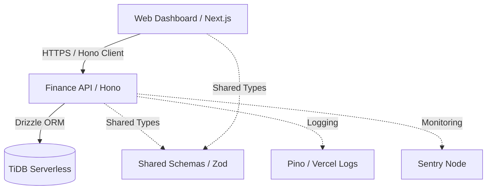

# Finance Tracker — Technical Architecture

This document describes the high-level architecture and design patterns used in the Finance Tracker V3 project.

## 🏛️ High-Level Architecture

The project is structured as a **Turborepo Monorepo**, optimizing for code sharing and unified developer experience.

## 📂 Monorepo Organization

- **`apps/api`**: The core backend. Stateless, high-performance API built with Hono.
- **`apps/web`**: The user interface. Next.js 15 App Router.
- **`packages/db`**: The data layer. Contains Drizzle schema, migrations, and the **Repository Pattern** implementation.
- **`packages/shared-schemas`**: The source of truth for all data structures (Zod). Ensures 100% type-safety from DB to UI.
- **`packages/api-client`**: A generated-like typed client for the frontend to consume the API.

## 🔄 Data Flow (Request Life Cycle)

1. **Request**: Frontend sends a request with `x-correlation-id` and `Idempotency-Key`.
2. **Middleware**:
   - `correlationId`: Assigns/traces IDs.
   - `authMiddleware`: Verifies Firebase Session Cookies.
   - `rateLimitMiddleware`: Protects sensitive endpoints.
3. **Route**: Hono router handles the request and validates input via `@hono/zod-validator`.
4. **Service**: Business logic resides here. Services coordinate between repositories (e.g., creating a transaction when a bill is paid).
5. **Repository**: Encapsulates Drizzle queries. Supports atomic transactions by accepting an optional `tx` parameter.
6. **Database**: TiDB Serverless executes the distributed SQL.

## 💎 Core Technical Patterns

### 1. Service Layer & Dependency Injection (DI)
Services are decoupled from repositories. A central `container.ts` manages instantiation, facilitating unit testing and maintenance.

### 2. Financial Precision (The "Decimal Trap" Defense)
- **Database**: Stored as `DECIMAL(15, 2)`.
- **API Transfer**: Transferred as `string` in JSON to avoid float precision loss.
- **Logic**: All math performed using `Decimal.js`.
- **UI**: Formatted for display using `Intl.NumberFormat`.

### 3. Idempotency & Cold Start Defense
Every mutation (`POST`, `PUT`, `DELETE`) requires an `Idempotency-Key`. This is stored in the database with a `UNIQUE` constraint. If a serverless function retries due to a cold start timeout, the second request is safely rejected or returns the cached result.

### 4. Soft Delete & Immutability
Records are rarely physically deleted. We use `deleted_at` timestamps to preserve audit trails. Historical ledger entries (`transactions`) are treated as immutable events.

### 5. Budget-First Engine
The Budget Engine uses optimized aggregate queries to calculate spending across multiple categories and wallet scopes in a single pass, avoiding N+1 query bottlenecks.

---
*Last Updated: 2026-04-27*
