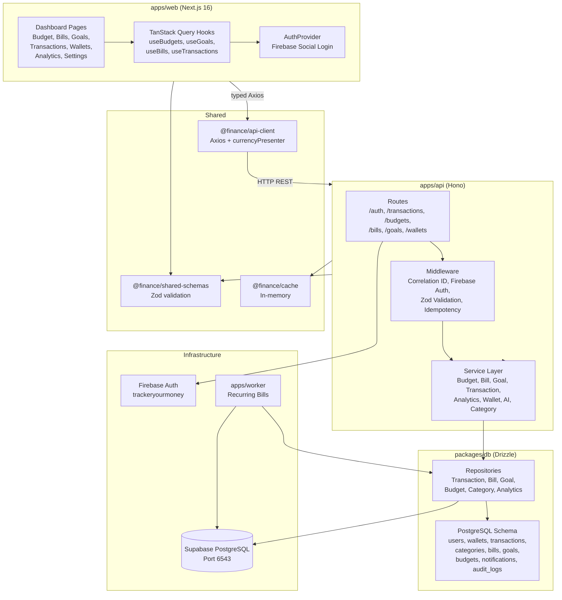

# Finance Tracker — Technical Architecture

Generated from GitNexus knowledge graph — 2026-05-03.  
Database: **Supabase PostgreSQL** (`aws-1-ap-south-1.pooler.supabase.com:6543`)

---

## Overview

Finance-for-me is a personal finance tracking monorepo (Turborepo + pnpm):

| Package | Tech | Role |
|---------|------|------|
| `apps/api` | Hono (Node.js) | REST API, Firebase auth, business logic |
| `apps/web` | Next.js 16 (App Router) | Dashboard UI, TanStack Query, shadcn/ui |
| `apps/worker` | tsx | Recurring bills processor |
| `packages/db` | Drizzle ORM + PostgreSQL | Schema, migrations, repositories |
| `packages/api-client` | Axios | Typed API client, currency formatting |
| `packages/shared-schemas` | Zod | Validation schemas shared API + Web |
| `packages/cache` | In-memory | Response caching |

**Stats**: 213 files, 1900 symbols, 28 execution flows, 6 functional areas.

---

## Functional Areas (GitNexus Clusters)

### Services (39 symbols, 85% cohesion)
Core business logic — `BudgetService`, `BillService`, `GoalService`, `TransactionService`, `AnalyticsService`, `WalletService`, `AIService`, `CategoryService`
- Auth chain: Firebase ID token → `verifyFirebaseIdToken` → `getAuth` → `clean`
- JWT: `signAccessToken` / `signRefreshToken` / `verifyToken` → `getSecret`
- Money: All arithmetic via `Decimal.js`, transport as strings
- DI container: `apps/api/src/services/container.ts`

### Repositories (25 symbols, 78% cohesion)
Drizzle ORM data access — `TransactionRepository`, `BillRepository`, `GoalRepository`, `BudgetRepository`, `CategoryRepository`, `AnalyticsRepository`
- All extend `BaseRepository` with `this.db` (PostgreSQL `pg` Pool)
- Soft delete via `deleted_at` + idempotency via UNIQUE constraint
- Optimistic concurrency via `version` column with `rowCount` check

### _components (16 symbols, 94% cohesion)
Dashboard UI views — `BillsView`, `GoalsView`, `AnalyticsView`, `SettingsView`, `TransactionsView`, `BudgetDetailPage`, `SummaryStrip`, `WalletItemCard`
- Currency rendering via `toDecimal()` / `formatCurrency()` / `formatVND()` from `packages/api-client`

### Hooks (13 symbols, 100% cohesion)
TanStack Query hooks — `useBudgets`, `useTransactions`, `useGoals`, `useBills`, `useCategorySpending`, `useMonthlyTrend`, `useBudgetSummary`
- Container components: `BillsContainer`, `GoalsContainer`, `AnalyticsContainer`

### Wallets (6 symbols, 83% cohesion)
Multi-wallet — `WalletsPage`, `AddWalletModal`, `useWallet`, `handleSave`, `handleDelete`, `formatBalanceInput`

### Context (5 symbols, 100% cohesion)
Auth providers — `loginWithGoogle`, `loginWithFacebook`, `loginWithApple`, `loginWithGithub`, `loginWithSocial`

---

## Key Execution Flows (Top 5)

### 1. Auth: Social Login
```
socialLogin → verifyFirebaseIdToken → getAuth → clean
            → signAccessToken → getSecret
```
1. Verify Firebase ID token via Firebase Admin SDK
2. Sync/link user in PostgreSQL (insert with `.returning()`)
3. Create user settings + default wallet
4. Issue JWT tokens (access + refresh)
5. Set session cookie (14-day TTL)

### 2. Auth: Token Refresh
```
refreshAccessToken → verifyToken → getSecret
```
- Validate refresh token hash (SHA-256) against DB
- Issue new access token

### 3. DI Container Bootstrap
```
constructor → initialize → CategoryRepository
```
- `apps/api/src/services/container.ts` wires all services
- Supports `initialize(dbInstance)` for test isolation
- Repositories inject `db` from `@finance/db`

### 4. Wallet → Currency Formatting
```
WalletsPage → handleSave → formatCurrency → toDecimal
```
- All money values flow through `packages/api-client/src/presenters/currencyPresenter.ts`
- `toDecimal` converts string → Decimal.js → number for display
- `formatCurrency` / `formatVND` use `Intl.NumberFormat('vi-VN')`

### 5. Soft Delete Pattern
```
delete → update (set deletedAt) → findById
```
- Bills, Goals, Budgets, Wallets use soft delete
- `deleted_at` timestamp → filtered with `isNull(deletedAt)` in queries
- Transactions are immutable (never updated, only marked deleted)

---

## Architecture Diagram



---

## Request Lifecycle

```
Client Request
  → Correlation ID middleware (tracing)
  → Firebase Auth middleware (session cookie via jose)
  → Zod validation (@hono/zod-validator)
  → Route handler
  → Service (business logic, Decimal.js arithmetic)
  → Repository (Drizzle query builder)
  → Supabase PostgreSQL (pg Pool, SSL, port 6543)
```

## Design Decisions

1. **Money is never float**: DB `DECIMAL(15,2)` → JSON string → `Decimal.js` → `Intl.NumberFormat`
2. **Idempotency**: All mutations require `Idempotency-Key` header, UNIQUE constraint in DB
3. **Soft delete**: Financial records use `deleted_at` timestamps, not physical deletion
4. **Transactions are immutable**: Ledger entries never updated, only soft-deleted
5. **OCC**: Wallet balance updates use optimistic concurrency control via `version` column
6. **Bill & Goal integrity**: Wrapped in `db.transaction()` for atomic insert + ledger entry
