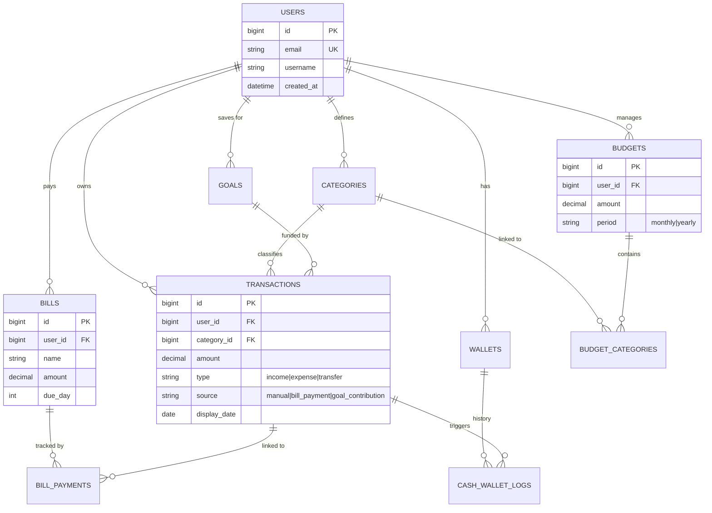

# ERD & API Documentation (S2S Finance)

Contrary to the assumption, the project actually has a very well-defined **Database Schema (ERD)** and a comprehensive set of **API Endpoints** already implemented. The business logic has been stabilized around the **Ledger-First** and **Budget-First** models.

## 📊 Entity Relationship Diagram (ERD)

The following diagram represents the current database structure defined in Drizzle:

## 🌐 API Endpoints

The API is built with Hono and grouped into the following modules:

### 1. Authentication (`/api/auth`)
- `POST /login`: Login and set session cookie.
- `POST /logout`: Clear session.
- `GET /me`: Get current user info.

### 2. Transactions (`/api/transactions`)
- `GET /`: List transactions (with filtering/pagination).
- `POST /`: Create new transaction (Ledger entry).
- `GET /:id`: Get details.
- `DELETE /:id`: Soft delete.

### 3. Budgets (`/api/budgets`)
- `GET /summary`: Get S2S (Safe-to-Spend) status and budget usage.
- `GET /`: List budgets.
- `POST /`: Create/Update budget.

### 4. Bills (`/api/bills`)
- `GET /`: List recurring bills.
- `POST /pay/:id`: **Logic Hardened**: Pays a bill and auto-creates an expense transaction.

### 5. Goals (`/api/goals`)
- `GET /`: List savings goals.
- `POST /contribute/:id`: **Logic Hardened**: Adds savings and auto-creates an expense transaction.

### 6. Wallets (`/api/wallet`)
- `GET /cash`: Get cash wallet balance.
- `POST /sync`: Sync local cash transactions with DB.

## 💡 Business Logic Maturity

The logic is now **Clear and Hardened**:
1.  **Budget-First**: The UI focuses on "How much can I spend today?" (S2S).
2.  **Ledger-First**: Every financial movement (even paying a bill or saving for a goal) **MUST** result in a `transaction` record. This ensures the "Spent" amount in budgets is always accurate.
3.  **Atomic Operations**: All multi-step processes (e.g., paying a bill + creating a transaction) are wrapped in database transactions.

---
*The foundational architecture is complete. Future work should focus on UI/UX and advanced analytics.*
