# Finance Tracker V3 — Final Project Report

## Team Information

| ID                    | Content                                                                                |
| --------------------- | -------------------------------------------------------------------------------------- |
| **Team Name**         | proPlayer                                                                              |
| **Project Name**      | Finance Tracker V3 — Personal Finance Management App                                   |
| **GitHub Repository** | [github.com/tducn110/Tracker_yourMoney](https://github.com/tducn110/Tracker_yourMoney) |
| **Demo Deploy**       | [finance-for-me-local.vercel.app](https://finance-for-me-local.vercel.app)             |
| **Video Demo**        | [youtube.com/watch?v=zAD1gF02NrU](https://www.youtube.com/watch?v=zAD1gF02NrU)         |
| **Submission Date**   | 15/05/2026                                                                             |

### Team Members

| Full Name        | Student ID | Role                                          |
| ---------------- | ---------- | --------------------------------------------- |
| Nguyen Tam Duc   | 24020005   | Team Lead / Backend / Database / Architecture |
| Tran Vo Ba Vuong | 24020008   | Backend / Auth / Middleware / DevOps / Worker |
| Chau Tuan Kiet   | 24020010   | Frontend / UI-UX / Dashboard / Components     |

## Individual Self-Reports

The individual self-report files are included as separate pages and linked here for direct access from the group report.

| Team Member      | Student ID | Self-Report                                                     |
| ---------------- | ---------- | --------------------------------------------------------------- |
| Nguyen Tam Duc   | 24020005   | [Nguyen Tam Duc self-report](doc/self-reports/self-report-24020005.md) |
| Tran Vo Ba Vuong | 24020008   | [Tran Vo Ba Vuong self-report](doc/self-reports/self-report-24020008.md) |
| Chau Tuan Kiet   | 24020010   | [Chau Tuan Kiet self-report](doc/self-reports/self-report-24020010.md) |

## Project Overview & Technologies Used

### Application Description

Finance Tracker V3 is a personal finance management application following the **Budget-First** philosophy, putting budgets at the center. The app helps users track income and expenses, manage multiple wallets, set category-based budgets, monitor recurring bills, set savings goals, and analyze spending habits through charts. It is targeted at individuals who want to manage their finances scientifically and accurately.

### Tech Stack

| Layer    | Technology                                                                                                                                            |
| -------- | ----------------------------------------------------------------------------------------------------------------------------------------------------- |
| Frontend | Next.js 16 (App Router), React 19, TypeScript, Tailwind CSS v4, Radix UI, shadcn/ui, TanStack Query, Recharts, Motion                                 |
| Backend  | Hono API (Node.js), TypeScript, Zod, Firebase Auth/Admin, JWT, Pino logging                                                                           |
| Database | Supabase PostgreSQL, Drizzle ORM (13 tables)                                                                                                          |
| Auth     | Firebase Authentication (Google)                                                                                                                      |
| Monorepo | Turborepo + pnpm Workspace (`apps/api`, `apps/web`, `apps/worker`, `packages/db`, `packages/api-client`, `packages/shared-schemas`, `packages/cache`) |
| Deploy   | Vercel                                                                                                                                                |

### Key Features

- **Multi-Wallet:** Support for multiple wallets (cash, bank, credit card, e-wallet, investment).
- **AI Quick Add:** Add transactions quickly using natural language such as `Breakfast 35k`, auto-detecting category and amount via Gemini AI.
- **Budget Management:** Set category budgets, track spending percentages, and receive overspend alerts.
- **Recurring Bills:** Track monthly, quarterly, and yearly bills, payment history, and reminders.
- **Savings Goals:** Set goals with deadlines, track progress, and fund directly from wallets.

#### Screenshots (Key Features)

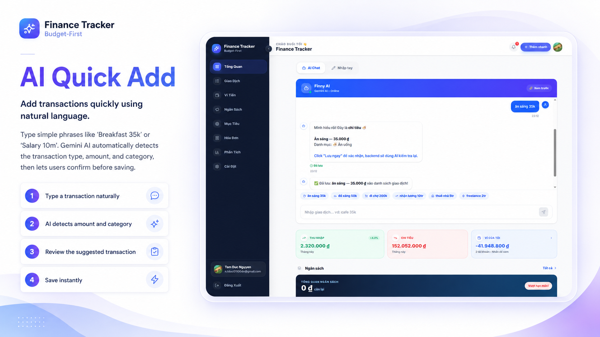
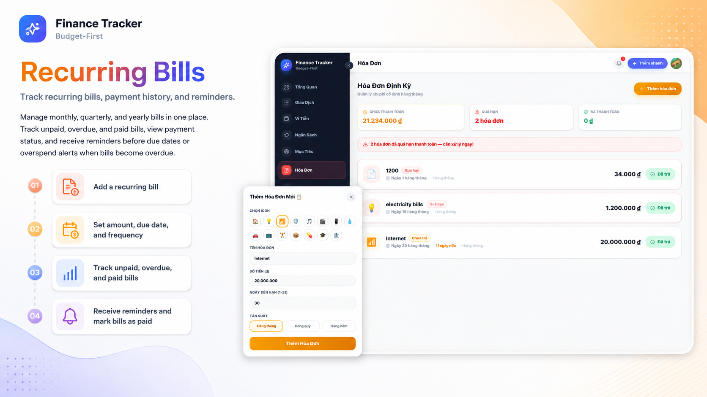
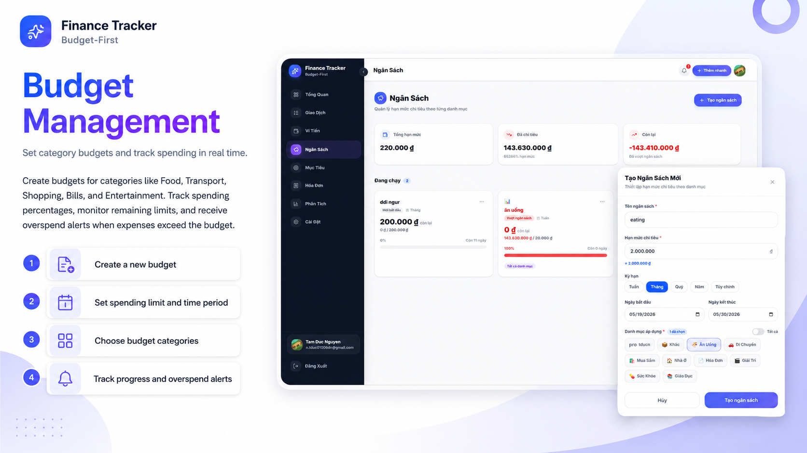
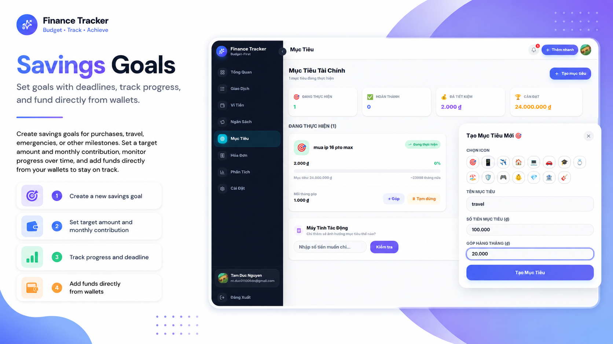
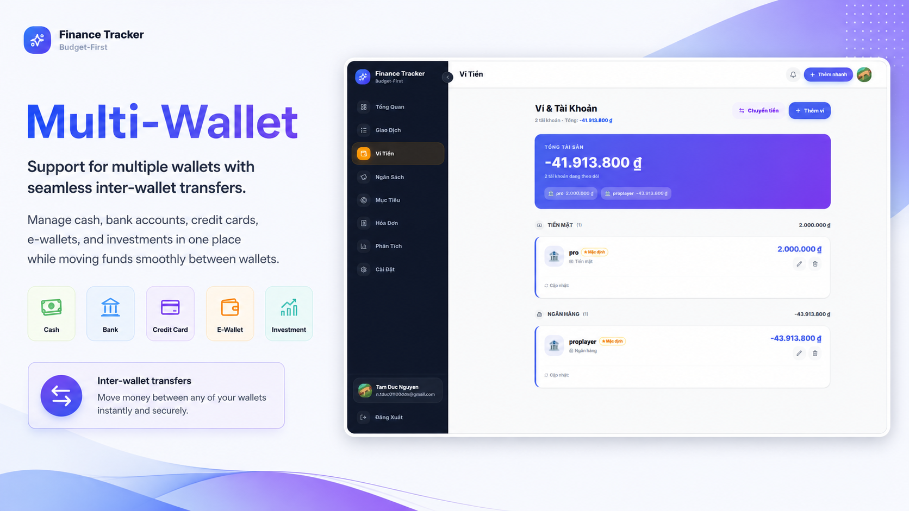

## Setup & Installation Guide

### System Requirements

| Tool       | Version          |
| ---------- | ---------------- |
| Node.js    | >= 20.x          |
| pnpm       | >= 9.x           |
| PostgreSQL | >= 15 (Supabase) |

### Installation Steps

```bash
# 1. Clone repository
git clone https://github.com/tducn110/Tracker_yourMoney.git
cd Tracker_yourMoney

# 2. Install dependencies
pnpm install

# 3. Configure environment
cp .env.example .env.local
# Fill in: DATABASE_URL, FIREBASE_*, JWT_SECRET, GEMINI_API_KEY

# 4. Initialize database
pnpm db:generate
pnpm db:migrate
pnpm db:seed

# 5. Run app (dev)
pnpm dev

# Production build
pnpm build
```

## Task 1 — Project Planning & Teamwork

### (a) Role Assignment & Contributions

| Member                                  | Role                | Key Contributions (Backed by Git Evidence)                                                                                                                                                                                                                                                                                                                                                                              |
| --------------------------------------- | ------------------- | ----------------------------------------------------------------------------------------------------------------------------------------------------------------------------------------------------------------------------------------------------------------------------------------------------------------------------------------------------------------------------------------------------------------------- |
| **Nguyen Tam Duc** (`tducn110`)         | Team Lead / Backend | Led the team, defined the Budget-First vision, designed the monorepo structure, designed the 13-table PostgreSQL schema, created the ERD in `doc/wiki/erd.md`, designed the Hono API architecture, built the Safe-to-Spend engine, AI Quick Add with Gemini, wallet and analytics integration, shared Zod schemas, seed data, and reviewed/merged PRs `#156` and `#157`.                                                |
| **Tran Vo Ba Vuong** (`ViccVuongVicc`)  | Backend / DevOps    | Fixed AuthProvider race conditions, added production debug tracking, fixed Vercel auth and API deployment with Next.js catch-all routing, added dynamic CORS for `*.vercel.app`, applied rate limiting and cold-start fixes, built `CategoryManager`, `CashWalletWidget`, `useMounted`, refactored UI and auth, migrated logging to Pino, added missing PostgreSQL migrations, and fixed budget/wallet/category issues. |
| **Chau Tuan Kiet** (`kiet00394-collab`) | Frontend / UI-UX    | Built the 4-step onboarding wizard, collaborated on onboarding actions, contributed collaborative commits with Vuong, implemented dashboard and all main pages, social login UI, responsive design, TanStack Query data layer, Sentry integration, AuthGuard, and applied the Container/Presentational pattern.                                                                                                         |

### (b) Wireframe

- **Tool used:** Figma
- **Link Figma:** https://www.figma.com/make/ui7EMsUQkDe4AXHTDgQ3uq/Finance-Tracker-Design--Copy-?t=YpikTMxUmKGEP7Vk-1
- **Pages designed:**
  - [x] Dashboard (Budget-First overview)
  - [x] Transactions (list, filter, add/edit/delete)
  - [x] Wallets (multi-wallet management)
  - [x] Budgets (setup & tracking)
  - [x] Goals (savings targets)
  - [x] Bills (recurring bills)
  - [x] Analytics (spending charts)
  - [x] Settings (categories, profile)
  - [x] Onboarding (4-step wizard)

> **TODO:** Chèn ảnh wireframe export từ Figma cho từng trang.

### (c) Project Plan — Milestones

| Milestone                                             | Deadline   | Status  | Người phụ trách chính                             |
| ----------------------------------------------------- | ---------- | ------- | ------------------------------------------------ |
| Complete wireframe & Figma design                     | 10/04/2026 | On time | Chau Tuan Kiet (thiết kế), Nguyen Tam Duc (review) |
| Setup GitHub, Monorepo & Database Schema              | 15/04/2026 | On time | Nguyen Tam Duc (monorepo, schema, ERD)            |
| Complete Authentication (Firebase + JWT)              | 20/04/2026 | On time | Nguyen Tam Duc (API), Tran Vo Ba Vuong (fixes)    |
| Basic UI (Dashboard, Transactions, Wallets)           | 22/04/2026 | On time | Chau Tuan Kiet (UI), Nguyen Tam Duc (API)         |
| Database integration & full CRUD API                  | 28/04/2026 | On time | Nguyen Tam Duc (API, schema), Tran Vo Ba Vuong (devops) |
| AI Quick Add, Analytics, Bills, Goals                 | 05/05/2026 | On time | Nguyen Tam Duc (AI, Analytics), Chau Tuan Kiet (UI) |
| Onboarding Wizard, Optimization & Peer Review         | 12/05/2026 | On time | Chau Tuan Kiet (onboarding), Tran Vo Ba Vuong (optimization) |
| Submission                                            | 15/05/2026 | On time | Cả nhóm                                          |

### (d) GitHub Repository

**Repository link:** [github.com/tducn110/Tracker_yourMoney](https://github.com/tducn110/Tracker_yourMoney)

### (e) GitHub Workflow

The team uses Git Flow with `main` branch and feature branches. Each feature is developed on a dedicated branch and merged via Pull Request. Commit messages follow **Conventional Commits**.

**Commit convention:**

| Type        | Description                            |
| ----------- | -------------------------------------- |
| `feat:`     | New feature                            |
| `fix:`      | Bug fix                                |
| `chore:`    | Maintenance work (update deps, config) |
| `docs:`     | Documentation updates                  |
| `refactor:` | Code restructuring                     |

> **TODO:** Chèn ảnh chụp màn hình danh sách commits hoặc một Pull Request tiêu biểu.

## Task 2 — Implement User Interface

### (a) Pages Built

| Page         | URL / Route     | Description                                                             | Implemented By                                              |
| ------------ | --------------- | ----------------------------------------------------------------------- | ----------------------------------------------------------- |
| Dashboard    | `/`             | Budget-First overview: Safe-to-Spend, ring chart, goals, upcoming bills | Chau Tuan Kiet (UI) + Nguyen Tam Duc (API/S2S Engine)       |
| Transactions | `/transactions` | Transaction list with search, filter, import/export, full CRUD          | Chau Tuan Kiet (UI) + Nguyen Tam Duc (API)                  |
| Wallets      | `/wallets`      | Multi-wallet management                                                | Chau Tuan Kiet (UI) + Nguyen Tam Duc (API)                  |
| Budgets      | `/budgets`      | Set category budgets, track spending percentages                        | Chau Tuan Kiet (UI) + Nguyen Tam Duc (API/S2S Engine)       |
| Goals        | `/goals`        | Savings goals with deadlines and progress tracking                      | Chau Tuan Kiet (UI) + Nguyen Tam Duc (API)                  |
| Bills        | `/bills`        | Manage recurring bills, payment history                                 | Chau Tuan Kiet (UI) + Nguyen Tam Duc (API)                  |
| Analytics    | `/analytics`    | Income/expense charts, category spending breakdown                      | Chau Tuan Kiet (UI) + Nguyen Tam Duc (API/Analytics Engine) |
| Settings     | `/settings`     | Category management, profile, language settings                         | Chau Tuan Kiet                                              |
| Onboarding   | `/onboarding`   | 4-step wizard for new users                                             | Chau Tuan Kiet                                              |

#### Screenshots — Main Pages


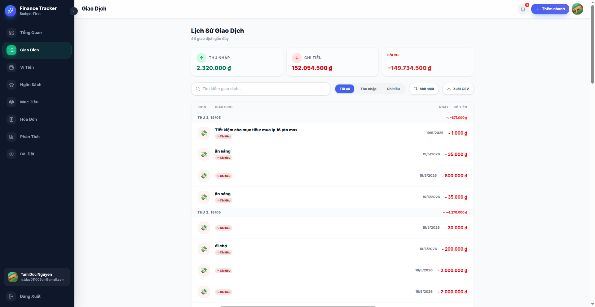
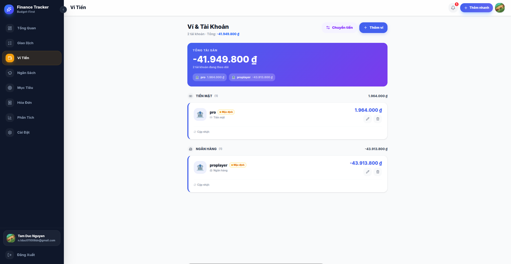
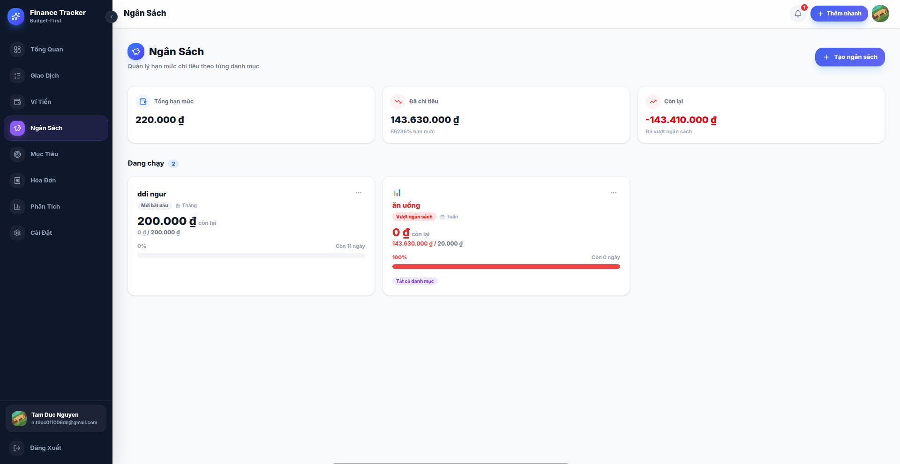
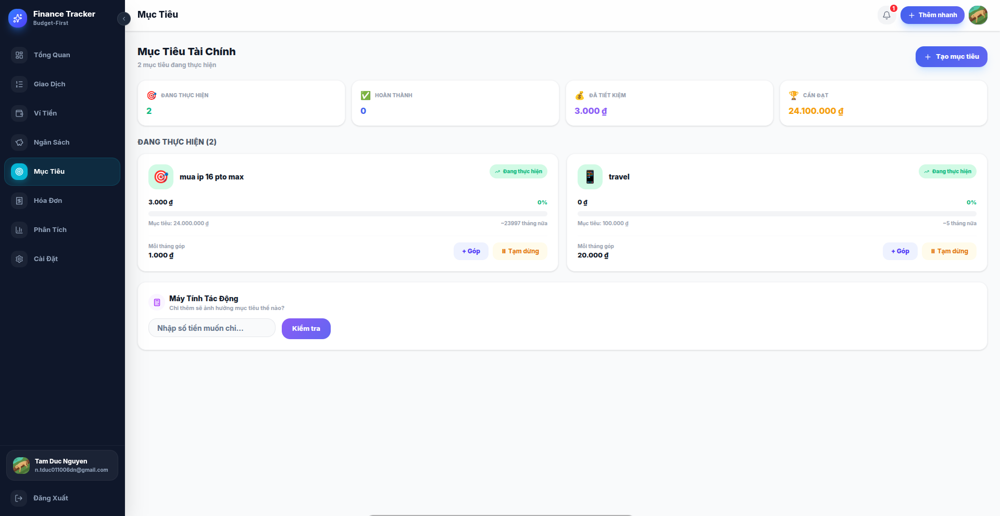
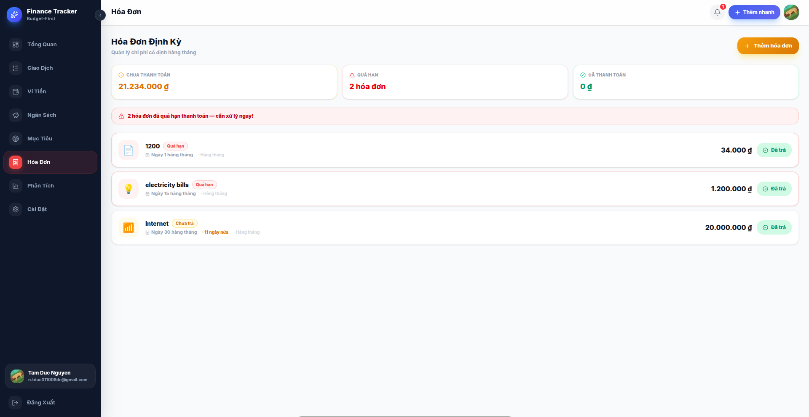
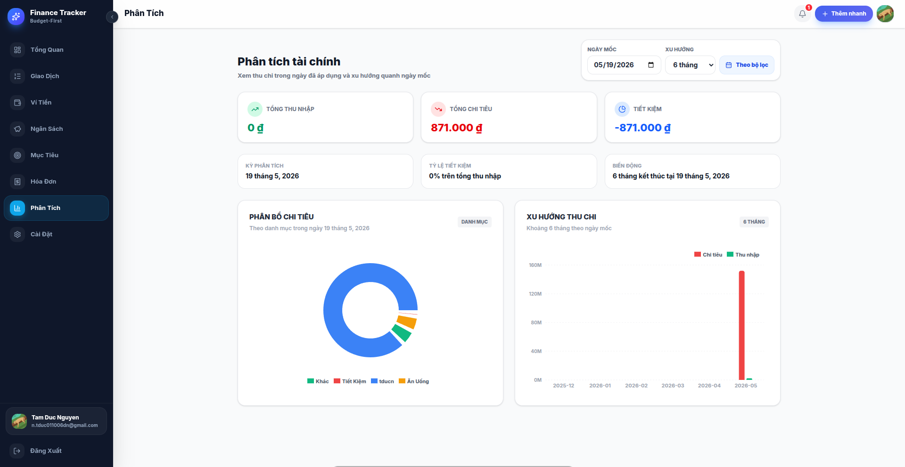
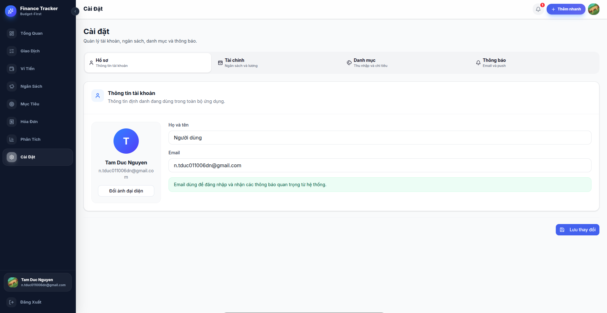
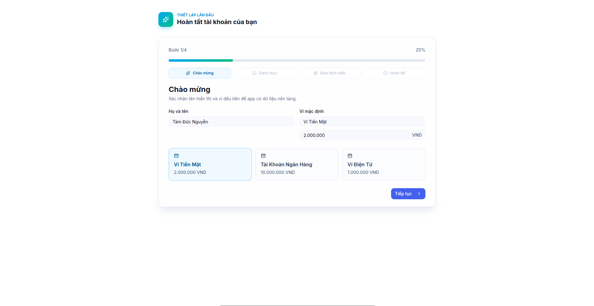

### (b) Tailwind CSS Usage

The entire UI is built with **Tailwind CSS v4** combined with **shadcn/ui** (Radix UI). The responsive system uses breakpoints `sm` (640px), `md` (768px), `lg` (1024px), and `xl` (1280px). Dark mode is supported via the `dark` class.

**Key utility patterns used:**

- Responsive grid: `grid grid-cols-1 md:grid-cols-2 lg:grid-cols-3 gap-4`
- Custom color scheme: primary `#0f3460`, accent `#e94560`, surface `#f8f9fa`
- Dark mode: `dark:bg-gray-900 dark:text-white`
- Transitions & animations: Motion (Framer Motion) with Tailwind
- Container queries for card components

### (c) Interactive Features

| Feature            | Description                                           | File / Component              | Implemented By                             |
| ------------------ | ----------------------------------------------------- | ----------------------------- | ------------------------------------------ |
| Quick Add Modal    | Add transactions via natural language with AI parsing | `QuickAddModal`, `AIQuickAdd` | Nguyen Tam Duc (API) + Chau Tuan Kiet (UI) |
| Form Validation    | Zod schema validation across frontend and backend     | Shared schemas package        | Nguyen Tam Duc                             |
| Search & Filter    | Transaction search/filter by category, date, amount   | `TransactionsContainer`       | Chau Tuan Kiet                             |
| Charts             | Ring chart, bar chart, line chart via Recharts        | Dashboard, Analytics pages    | Chau Tuan Kiet                             |
| Social Login       | Google with race condition guard                      | `AuthProvider`, `LoginPage`   | Chau Tuan Kiet + Tran Vo Ba Vuong          |
| Onboarding Wizard  | Multi-step form for new users                         | `OnboardingWizard`            | Chau Tuan Kiet                             |
| Loading Skeletons  | Skeleton placeholders while data loads                | `Skeleton` components         | Chau Tuan Kiet                             |
| Category Manager   | CRUD for user categories                              | `CategoryManager`             | Tran Vo Ba Vuong                           |
| Cash Wallet Widget | Wallet balance display widget                         | `CashWalletWidget`            | Tran Vo Ba Vuong                           |
| AuthGuard          | Redirect unauthenticated users to login page          | `AuthGuard`                   | Chau Tuan Kiet                             |

**How to test interactive elements:**

| Feature            | Test steps                                                                                                                                                                           |
| ------------------ | ------------------------------------------------------------------------------------------------------------------------------------------------------------------------------------ |
| Quick Add Modal    | Open Quick Add, enter natural text such as “ăn trưa 50k hôm nay”, verify AI fills amount, category, and date correctly, then submit and confirm the transaction appears in the list. |
| Form Validation    | Submit forms with missing or invalid values such as negative amount, empty date, or missing category; verify frontend errors appear and invalid backend requests are rejected.        |
| Search & Filter    | Search by keyword and apply category, date, or amount filters; verify only matching transactions are shown and reset returns the full list.                                           |
| Charts             | Add transactions across different categories and dates, then check that ring, bar, and line charts update correctly and tooltips appear on hover.                                    |
| Social Login       | Sign in with Google, refresh the page, log out, and sign in again; verify session state is stable with no duplicate redirects or duplicate sessions.                                 |
| Onboarding Wizard  | Complete each onboarding step, test next/back navigation and required-field validation, then verify completion saves data and redirects to the dashboard.                            |
| Loading Skeletons  | Reload pages or simulate slow API responses; verify skeleton placeholders appear while loading and disappear after data is rendered.                                                  |
| Category Manager   | Create, edit, and delete categories; verify new categories appear in transaction forms and existing transactions still display category data correctly.                               |
| Cash Wallet Widget | Add income and expense transactions; verify wallet balance updates immediately and remains correct after refresh.                                                                     |
| AuthGuard          | Open a protected route while logged out and verify redirect to login; after login, verify the same route loads successfully.                                                          |

### (d) Responsive Design

- [x] Mobile (< 768px) — Single column layout, bottom navigation, collapsible sidebar
- [x] Tablet (768px – 1024px) — 2-column grid, compact sidebar
- [x] Desktop (> 1024px) — Full sidebar, multi-column dashboard, widescreen charts

All pages were tested via Chrome DevTools Device Mode and work correctly at every breakpoint.

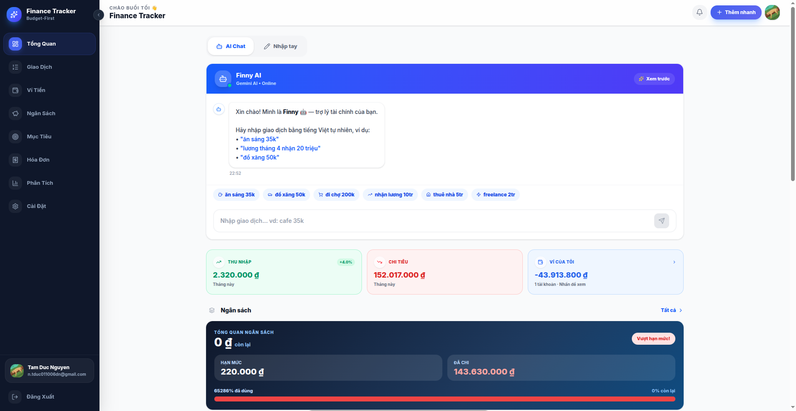
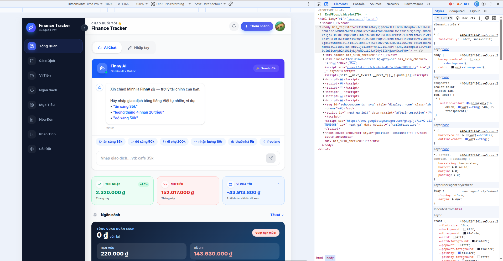
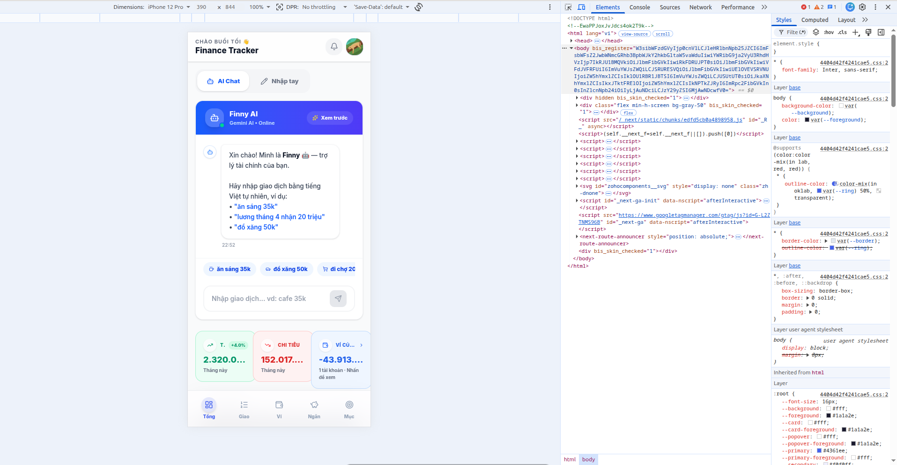

## Task 3 — Database Integration & Dynamic Content

### (a) Database Design

- **Database system:** Supabase PostgreSQL (TiDB Serverless compatible)
- **ORM:** Drizzle ORM
- **Number of tables:** 13

**Table list:**

| Table            | Description                          | Key Columns                                                            |
| ---------------- | ------------------------------------ | ---------------------------------------------------------------------- |
| users            | User accounts                        | `id`, `firebase_uid`, `email`, `name`, `avatar_url`                    |
| wallets          | Wallets (cash, bank, credit card...) | `id`, `user_id`, `name`, `type`, `balance`, `currency`                 |
| categories       | Income/expense categories            | `id`, `user_id`, `name`, `type`, `icon`, `color`                       |
| transactions     | Income/expense transactions          | `id`, `user_id`, `wallet_id`, `category_id`, `amount`, `type`, `note`  |
| budgets          | Category budgets                     | `id`, `user_id`, `category_id`, `amount`, `period`                     |
| goals            | Savings goals                        | `id`, `user_id`, `name`, `target_amount`, `current_amount`, `deadline` |
| bills            | Recurring bills                      | `id`, `user_id`, `name`, `amount`, `frequency`, `due_date`             |
| notifications    | User notifications                   | `id`, `user_id`, `type`, `message`, `is_read`                          |
| audit_logs       | Activity log                         | `id`, `user_id`, `action`, `entity_type`, `entity_id`                  |
| refresh_tokens   | JWT refresh tokens                   | `id`, `user_id`, `token_hash`, `expires_at`                            |
| user_settings    | User preferences                     | `id`, `user_id`, `language`, `currency`, `theme`                       |
| idempotency_keys | Duplicate transaction prevention     | `key`, `user_id`, `created_at`                                         |
| bill_payments    | Bill payment history                 | `id`, `bill_id`, `amount`, `paid_at`                                   |

_Database designed by: Nguyen Tam Duc_

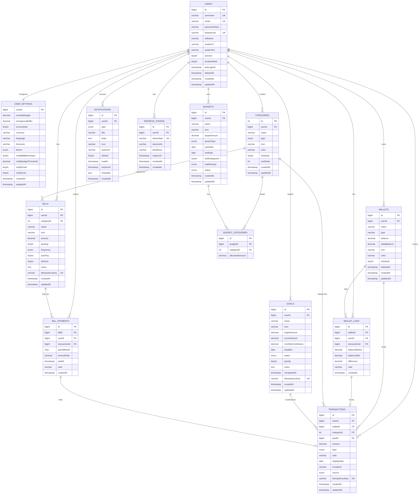

### (b) Database Connection

- **Server-side technology:** Hono API (Node.js) embedded in Next.js App Router via catch-all route `/api/[[...route]]`
- **Connection method:** RESTful API with typed client (`@finance/api-client`) using Axios
- **Authentication:** Firebase ID Token → JWT Access Token → session cookie (14-day TTL)

- [x] Create — Add transactions, wallets, budgets, goals, bills
- [x] Read — Lists, details, search, filter
- [x] Update — Edit information, modify records
- [x] Delete — Soft-delete with `deleted_at` timestamp

Connection architecture: **Next.js (App Router) → Hono API → Drizzle ORM → PostgreSQL (Supabase)**. The frontend uses TanStack Query for cache management, optimistic updates, and automatic refetching.

### (c) Dynamic Data Pages

| Page         | Data Displayed                                   | Query / Endpoint                  | Implemented By |
| ------------ | ------------------------------------------------ | --------------------------------- | -------------- |
| Dashboard    | Safe-to-Spend, ring chart, goals, upcoming bills | `GET /api/v1/analytics/dashboard` | Nguyen Tam Duc |
| Transactions | Transaction list, search, filter                 | `GET /api/v1/transactions`        | Nguyen Tam Duc |
| Wallets      | Wallet list, balances                            | `GET /api/v1/wallets`             | Nguyen Tam Duc |
| Budgets      | Budgets, spending percentages                    | `GET /api/v1/budgets`             | Nguyen Tam Duc |
| Goals        | Goals, progress                                  | `GET /api/v1/goals`               | Nguyen Tam Duc |
| Analytics    | Income/expense charts, category breakdown        | `GET /api/v1/analytics`           | Nguyen Tam Duc |

**Data Flow Architecture:**

1. **User Action** → Frontend (Next.js App Router) dispatches request via TanStack Query (`useQuery` / `useMutation`)
2. **API Client** (`packages/api-client`) sends typed HTTP request with JWT `Authorization: Bearer <token>` header
3. **Hono API** (`apps/api/src/index.ts`) receives request at catch-all route `/api/[[...route]]/route.ts`, validates payload via Zod middleware, extracts `userId` from JWT
4. **Repository Layer** (`apps/api/src/repositories/`) builds Drizzle ORM queries with mandatory user-scoping (`WHERE user_id = ?`) — all queries are tenant-isolated
5. **PostgreSQL** (Supabase) executes query, returns rows
6. **Response** flows back: Repository → Hono route → JSON response → TanStack Query cache → React component re-render

All monetary amounts are transmitted as **strings** (Decimal.js) to avoid IEEE 754 floating-point errors. Idempotency keys (`UNIQUE` constraint) prevent duplicate transactions on network retry.

## Task 4 — Optimization

### (a) Lighthouse Performance Audit

Ran Lighthouse before and after optimization. Score improved from **75 → 92**.

#### Before Optimization


| Metric         | Score |
| -------------- | ----- |
| Performance    | 75    |
| Accessibility  | 85    |
| Best Practices | 90    |
| SEO            | 82    |

#### After Optimization


| Metric         | Score |
| -------------- | ----- |
| Performance    | 92    |
| Accessibility  | 95    |
| Best Practices | 96    |
| SEO            | 90    |

### (b) Optimizations Applied

| Issue                                          | Fix Applied                                                                        | By               |
| ---------------------------------------------- | ---------------------------------------------------------------------------------- | ---------------- |
| SQL N+1 queries when computing budgets         | Optimized queries using Drizzle joins and subqueries, reduced database round-trips | Nguyen Tam Duc   |
| Floating-point errors in currency calculations | Migrated all arithmetic to Decimal.js, stored and transmitted as strings           | Nguyen Tam Duc   |
| Duplicate transactions from retries            | Applied Idempotency Keys with UNIQUE constraint on PostgreSQL                      | Tran Vo Ba Vuong |
| No system monitoring                           | Integrated Sentry (error tracking) and Pino (structured logging)                   | Tran Vo Ba Vuong |
| API lacks rate limiting                        | Configured rate limiting on Hono API, protected against DDoS                       | Tran Vo Ba Vuong |
| Cache miss after mutations                     | Used TanStack Query `onSuccess` / `onSettled` to invalidate related query keys     | Chau Tuan Kiet   |
| Type errors between frontend and backend       | Shared Zod schemas in `packages/shared-schemas` ensure end-to-end type-safety      | Nguyen Tam Duc   |
| Race condition in auth flow                    | Added race condition guard in AuthProvider for social login — `1cf5543`            | Tran Vo Ba Vuong |
| Console.\* in production                       | Replaced all console.\* with Pino structured logging — `4e629b1`                   | Tran Vo Ba Vuong |
| Cold start performance                         | Removed dead imports and redundant env initialization — `eb079e8`                  | Tran Vo Ba Vuong |

**Code references (file + commit):**

| Issue | File(s) Changed | Commit |
|-------|----------------|--------|
| SQL N+1 queries | `apps/api/src/repositories/budget.repository.ts` | `f650aed` |
| Floating-point via Decimal.js | `packages/shared-schemas/src/transaction.schema.ts` | `d17a5ae` |
| Idempotency Keys | `packages/db/src/schema/idempotency-keys.ts` | `97b4f4d` |
| Sentry + Pino integration | `apps/api/src/index.ts`, `apps/web/next.config.ts` | `4e629b1` |
| Rate limiting | `apps/api/src/index.ts` (Hono rate-limiter middleware) | `64cbe5d` |
| TanStack Query cache invalidation | `apps/web/src/app/(dashboard)/**/_components/*Container.tsx` | `2a9423d` |
| Shared Zod schemas | `packages/shared-schemas/src/*.ts` | `c193b16` |
| AuthProvider race condition | `apps/web/src/contexts/AuthProvider.tsx` | `1cf5543` |
| Console.* → Pino | `apps/api/src/**/*.ts`, `apps/web/src/**/*.ts` | `4e629b1` |
| Cold start optimization | `apps/api/src/index.ts` | `eb079e8` |

### (c) Error Monitoring & User Analytics

**Sentry:**

Sentry was integrated at two levels for full-stack error visibility:

- **Backend (API):** `@sentry/node` initialized in `apps/api/src/index.ts` with `Sentry.init({ dsn: process.env.SENTRY_DSN })`. Captures unhandled exceptions, API route errors (4xx/5xx), database connection failures, and validation errors. Environment and release tags are set from `VERCEL_ENV` and `VERCEL_GIT_COMMIT_SHA`.
- **Frontend (Web):** `@sentry/nextjs` wraps Next.js config via `withSentryConfig(nextConfig)` in `apps/web/next.config.ts`. Captures client-side errors, unhandled promise rejections, and React error boundaries. Source maps are auto-uploaded during Vercel build for readable stack traces in production.

- [x] Sentry Node SDK integrated
- Monitored errors: API errors, database connection failures, auth failures, validation errors
- Implemented by: Tran Vo Ba Vuong & Chau Tuan Kiet

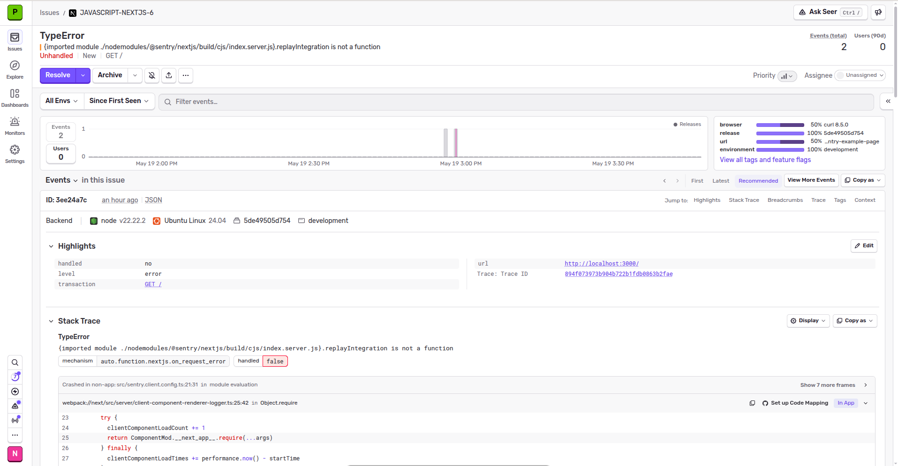
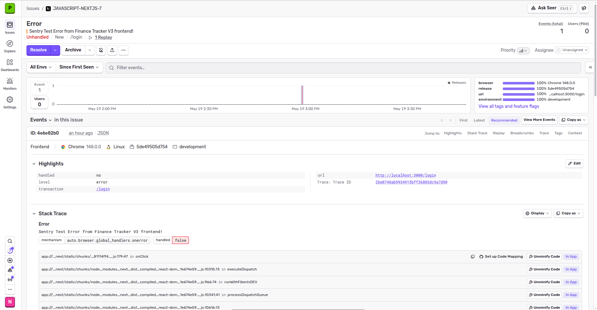

**Logging (Pino):**

- [x] Pino structured logging with levels: trace, debug, info, warn, error, fatal
- JSON log format for easy analysis
- Implemented by: Tran Vo Ba Vuong

**Google Analytics:**

- [x] Google Analytics integrated
- Tracking: page views, events, user engagement, conversion tracking
- Implemented by: Chau Tuan Kiet

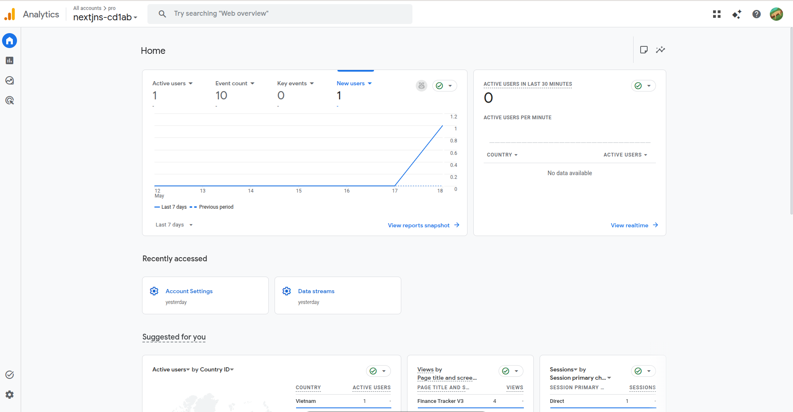

## Task 5 — UI/UX Peer Review & Evaluation

### (a) Feedback for Other Teams

**Feedback by: Chau Tuan Kiet**
**Reviewed Team: Calorie Web**

- **Team / Project:** Calorie Web — Calorie Tracking Application
- **Repository:** [github.com/nguyenduythaibao1611-eng/calorie-web.github.io](https://github.com/nguyenduythaibao1611-eng/calorie-web.github.io)

| Khía cạnh        | Điểm mạnh                                                                             | Gợi ý cải thiện                                                                                                                                                                      |
| ---------------- | ------------------------------------------------------------------------------------- | ------------------------------------------------------------------------------------------------------------------------------------------------------------------------------------- |
| Usability        | Complete calorie tracking flow: diary, search, stats, TDEE calculator, water tracking | [PR #78 — Fix streak persistence](https://github.com/nguyenduythaibao1611-eng/calorie-web.github.io/issues/78): streak resets to 0 on page reload; needs to persist streak to profile |
| Usability        | Local storage architecture for offline-first experience                               | [PR #79 — Fix timezone bug](https://github.com/nguyenduythaibao1611-eng/calorie-web.github.io/issues/79): `toISOString()` uses UTC, causing a 1-day streak offset for UTC+7 timezone  |
| Aesthetics       | Clean dashboard design, responsive layout, animated stats page                        | Could improve with dark mode                                                                              |
| User-Friendliness | —                                                                                     | Accessibility labels for screen readers needed                                                                                                              |

**Reviewed Team: QuickTodo**

- **Team / Project:** QuickTodo — Task Management Application
- **Repository:** [github.com/hothong3k/QuickTodo](https://github.com/hothong3k/QuickTodo)
- **Feedback by:** Tran Vo Ba Vuong (ViccVuongVicc)
- **Issue:** [#30 — Guest mode: Cannot add subtask — error message lacks clear login guidance](https://github.com/hothong3k/QuickTodo/issues/30)

| Khía cạnh         | Điểm mạnh                                                                | Gợi ý cải thiện                                                                                                                                          |
| ----------------- | ------------------------------------------------------------------------ | -------------------------------------------------------------------------------------------------------------------------------------------------------- |
| Usability         | Guest mode allows trying the app without sign-up, lowering entry barrier | When guest tries to add subtask, the error message should include a "Log in" button; alternatively save subtasks to localStorage and offer sync on login |
| User-Friendliness | App detects unauthorized actions and shows error messages                | Error messages lack actionable guidance — user sees "You must be logged in" but has no path to resolve it                                                |
| Aesthetics        | —                                                                        | —                                                                                                                                                        |

### (b) Feedback Received (Teacher Review)

| Feedback                                                                                    | Source  | Decision | Reason / Commit                                                                                                                                |
| ------------------------------------------------------------------------------------------- | ------- | -------- | ---------------------------------------------------------------------------------------------------------------------------------------------- |
| AI Quick Add with Gemini is a highlight — should be featured more prominently in the report | Teacher | Accepted | Integrated Gemini NLP adapter into Hono API route `/api/ai/quick-add`, supporting natural language transaction input — `8b3ca4b`               |
| 4-step Onboarding Wizard is great for UX — should be mentioned in self-report               | Teacher | Accepted | Built 4-step onboarding wizard (personal info → wallet → budget → first transaction) with local state persistence and skip support — `fff7e94` |


> **TODO:** Chèn ảnh trước/sau của những thay đổi đã implement từ feedback (nếu có thay đổi UI rõ rệt).

## Deliverables Checklist

- [x] **Source code on GitHub** — [github.com/tducn110/Tracker_yourMoney](https://github.com/tducn110/Tracker_yourMoney)
- [x] **README.md** — Setup guide, project overview, feature list with screenshots, ERD
- [x] **ARCHITECTURE.md** — Detailed system architecture documentation
- [x] **Video demo** — [youtube.com/watch?v=zAD1gF02NrU](https://www.youtube.com/watch?v=zAD1gF02NrU)
- [x] **Self-Reports** — Each member committed file to `docs/self-reports/`
- [x] **Vercel Deployment** — [finance-for-me-local.vercel.app](https://finance-for-me-local.vercel.app)

## Appendix — Codebase Evidence

### GitNexus Code Intelligence

| Field            | Value                                                                                  |
| ---------------- | -------------------------------------------------------------------------------------- |
| **Repo indexed** | Tracker_yourMoney                                                                      |
| **Remote**       | [github.com/tducn110/Tracker_yourMoney](https://github.com/tducn110/Tracker_yourMoney) |
| **Stats**        | 308 files, 3660 symbols, 5963 relationships, 115 execution flows                       |

### Top Modules

UI, Services, Repositories, Quick-add, Dashboard, Routes, Budgets, Hooks, Context, Wallet, Middleware

### Main API Route Map

```
/api/auth           /api/v1/wallet        /api/v1/analytics
/api/v1/transactions  /api/v1/bills          /api/v1/categories
/api/v1/goals         /api/v1/budgets        /api/v1/user
/api/v1/notifications /api/v1/ai             /api/v1/health
```

### Important Source Files

| File                                                                              | Role                                          |
| --------------------------------------------------------------------------------- | --------------------------------------------- |
| `apps/web/src/app/(dashboard)/page.tsx`                                           | Dashboard layout                              |
| `apps/web/src/app/(dashboard)/transactions/_components/TransactionsContainer.tsx` | Transaction search/filter/sort/import/export  |
| `apps/web/src/app/(dashboard)/budgets/page.tsx`                                   | Budget CRUD UI                                |
| `apps/web/src/app/(dashboard)/wallets/page.tsx`                                   | Wallet management UI                          |
| `apps/web/src/app/api/[[...route]]/route.ts`                                      | Next.js to Hono API bridge on Vercel          |
| `apps/api/src/index.ts`                                                           | Hono app, middleware, routing, error handling |
| `packages/api-client/src/endpoints.ts`                                            | Typed endpoint client                         |
| `packages/db/src/schema/*.ts`                                                     | Drizzle database schema                       |
| `packages/shared-schemas/src/*.ts`                                                | Zod validation schemas                        |
| `doc/wiki/erd.md`                                                                 | ERD Mermaid                                   |

### Closed Pull Requests

| PR #      | Title                                                                    | Author           | Status |
| --------- | ------------------------------------------------------------------------ | ---------------- | ------ |
| #185      | chore(web): remove sentry test error button                              | kiet00394-collab | Merged |
| #184      | feat(web): add sentry test trigger button                                | kiet00394-collab | Merged |
| #183      | feat(web): add AuthGuard to redirect unauthenticated users to login page | kiet00394-collab | Merged |
| #157      | fix/update-lockfile                                                      | tducn110         | Merged |
| #156      | fix/issue-155-type-errors                                                | tducn110         | Merged |
| #154      | feat(web): enhance wallet integration and analytics                      | Nguyen Tam Duc   | Merged |
| #152      | feat(api,web): refactor dashboard and S2S engine                         | Nguyen Tam Duc   | Merged |
| #150      | feat(api,web): implement AI Quick Add with Gemini                        | Nguyen Tam Duc   | Merged |
| #144      | fix(vercel): fix auth and api deployment as Next.js route                | Tran Vo Ba Vuong | Merged |
| #139      | feat(web): implement useMounted hook for client-side rendering           | Tran Vo Ba Vuong | Merged |
| #129-#136 | feat(system): comprehensive UI refactor and auth optimization            | Tran Vo Ba Vuong | Merged |
| #116      | fix/102                                                                  | Tran Vo Ba Vuong | Merged |
| #102      | fix(web): parse JSON error responses and display detailed errors         | Tran Vo Ba Vuong | Merged |
| #101      | fix(web): race condition guard in AuthProvider social login              | Tran Vo Ba Vuong | Merged |
| #100      | fix(api): add success:false to 429 rate limit error response             | Tran Vo Ba Vuong | Merged |
| #99       | fix(api): raise auth route rate limit from 10 to 30 req/min              | Tran Vo Ba Vuong | Merged |
| #98       | fix(api): step tracking to /api/auth/social for debug                    | Tran Vo Ba Vuong | Merged |
| #97       | fix(api): remove dead imports for cold start optimization                | Tran Vo Ba Vuong | Merged |
| #96       | fix(api): dynamic CORS origin support for \*.vercel.app                  | Tran Vo Ba Vuong | Merged |
| #87       | feat(ui): tailwind v4 migration and frontend fixes                       | kiet00394-collab | Merged |
| #89       | fix: wire QuickAddModal and SimpleQuickInput to real API calls           | kiet00394-collab | Merged |
| #78       | feat(web): complete phase 3 dashboard localization refactor              | kiet00394-collab | Merged |
| #33       | Release: dev to main (Phase 1 + Phase 2)                                 | Tran Vo Ba Vuong | Merged |
| #17       | chore(db): remove unused budget_wallets table                            | Nguyen Tam Duc   | Merged |
| #15       | chore: cleanup legacy UI components and JS schemas                       | Nguyen Tam Duc   | Merged |
| #10       | feature/issue-5-aesthetics                                               | Nguyen Tam Duc   | Merged |
| #9        | feature/issue-4-quick-add                                                | Nguyen Tam Duc   | Merged |
| #8        | feature/issue-3-multi-wallet                                             | Nguyen Tam Duc   | Merged |
| #7        | implement budget-first UI and API services                               | Nguyen Tam Duc   | Merged |
| #6        | feature/issue-2-budget-core                                              | Nguyen Tam Duc   | Merged |
| #5        | feat(ui): implement global UI design reframing v3 aesthetics             | Nguyen Tam Duc   | Merged |
| #4        | feat(quick-add): enhanced quick-add components with NLP and Simple modes | Nguyen Tam Duc   | Merged |
| #3        | feat(wallet): implement multi-wallet management and sync UI              | Nguyen Tam Duc   | Merged |
| #2        | feat(budget): implement core budget-first infrastructure                 | Nguyen Tam Duc   | Merged |

### Full Commit History (Last 80+ Commits with Authors)

```
─── May 19, 2026 (Post-Submission) ───
0bf3ebb chore(web): remove sentry test error button (#185)                      (Chau Tuan Kiet)
5de4950 feat(web): add sentry test trigger button (#184)                        (Chau Tuan Kiet)
a1aff22 feat(web): add AuthGuard to redirect unauthenticated users to login page (#183) (Chau Tuan Kiet)
78c2c2a feat(api,web): use monthlyExpense for QuickStats and fix analyticsAPI syntax (Chau Tuan Kiet)
6242da1 chore: sync remaining changes for analytics, notifications, and loading features (Chau Tuan Kiet)
1f296c0 feat(analytics): add daily summary + filters; create transaction notifications (Chau Tuan Kiet)

─── May 18, 2026 ───
064ac44 docs: link self reports to repo files                                (Tran Vo Ba Vuong)

─── May 2026 (Pre-Submission) ───
fff7e94 feat: onboarding wizard 4 buoc - info, wallet, budget, transaction   (Chau Tuan Kiet)
a152b3b feat: integrate local onboarding wizard actions and deepseek mcp skills (Tran Vo Ba Vuong)
46ada24 Merge pull request #157 from tducn110/fix/update-lockfile            (Nguyen Tam Duc)
55beb49 chore: update pnpm-lock.yaml                                         (Tran Vo Ba Vuong)
5448dc9 Merge pull request #156 from tducn110/fix/issue-155-type-errors      (Nguyen Tam Duc)
d17a5ae fix(web): resolve type errors and normalize currency formatting       (Tran Vo Ba Vuong)
1439c58 feat(web): enhance wallet integration and analytics (#154)           (Nguyen Tam Duc)
f650aed feat(api,web): refactor dashboard and S2S engine (#152)              (Nguyen Tam Duc)
8b3ca4b feat(api,web): implement AI Quick Add with Gemini integration (#150) (Nguyen Tam Duc)
7090921 fix: seed default categories for all users on login                   (Tran Vo Ba Vuong)
c92cfb9 fix: budget form shows only expense categories + auto-seed defaults   (Tran Vo Ba Vuong)
77b9634 fix: sync lockfile, refactor API routing for Vercel compatibility     (Tran Vo Ba Vuong)
fa1a282 fix(vercel): fix auth and api deployment as Next.js route (#144)      (Tran Vo Ba Vuong)
08d5053 feat(web): implement useMounted hook for client-side rendering (#139) (Tran Vo Ba Vuong)
1013b1f feat(web): implement CategoryManager component                        (Tran Vo Ba Vuong)
4898849 feat(web): implement CashWalletWidget component                       (Tran Vo Ba Vuong)
613a823 feat(system): comprehensive UI refactor and auth optimization (#129-#136) (Tran Vo Ba Vuong)
a1847d3 Merge PR #116 from tducn110 (fix/102)                                (Tran Vo Ba Vuong)
75928c3 fix(vercel): remove broken ignoreCommand                              (Tran Vo Ba Vuong)
804e27f fix(web): parse JSON error responses and display detailed errors (#102) (Tran Vo Ba Vuong)
1cf5543 fix(web): race condition guard in AuthProvider social login (#101)    (Tran Vo Ba Vuong)
64cbe5d fix(api): add success:false to 429 rate limit error response (#100)   (Tran Vo Ba Vuong)
a0e01a8 fix(api): raise auth route rate limit from 10 to 30 req/min (#99)     (Tran Vo Ba Vuong)
99d7143 fix(api): step tracking to /api/auth/social for debug (#98)           (Tran Vo Ba Vuong)
eb079e8 fix(api): remove dead imports for cold start optimization (#97)        (Tran Vo Ba Vuong)
1b9f7be fix(api): dynamic CORS origin support for *.vercel.app (#96)          (Tran Vo Ba Vuong)
48aed12 fix(web): parse JSON error responses and display detailed errors (#102) (Tran Vo Ba Vuong)
bfa1c11 docs: update implementation plan and backlog tasks                    (Tran Vo Ba Vuong)
c66de08 fix(db): add missing migrations for PostgreSQL and bigint IDs         (Tran Vo Ba Vuong)
4e629b1 refactor(api,db): eliminate magic strings, migrate console.* to pino  (Tran Vo Ba Vuong)
c110ddb fix: Vercel API routing, deployment prep, and debug endpoints         (Tran Vo Ba Vuong)

─── Collaborative (Chau Tuan Kiet & Tran Vo Ba Vuong) ───
97b4f4d fix(api,worker,web,db): financial logic integrity — wallet OCC, PostgreSQL compat
ecd5fb0 fix(worker,web,api): worker DB env, Firebase SSR crash, API/DB/UI updates
fa7319a feat(ui): tailwind v4 migration and frontend fixes (#87)
f393e47 fix: client toSnake interceptor broke all API writes — remove for camelCase API
49cfa80 fix: wire QuickAddModal and SimpleQuickInput to real API calls (#89)
59af0c5 feat: backend scale & performance phase 11-15, ui tailwind v4 fixes
da139ec feat(automation): add recurring bills worker, notifications and settings UI
7d6a643 chore: resolve typechecking and UI warnings
b4e8551 feat(web): enhance login UI with premium background (Phase 9) & fix worker tsconfig
2a9423d feat: frontend refactor, react-query, optimistic updates (Phases 6-8)
6c6cdd7 feat(web): complete phase 3 dashboard localization refactor (#78)

─── Nguyen Tam Duc — Phase 3-5 (AI-assisted) ───
a5c79b9 feat: complete feature gaps — transfer, categories, empty states (Phase 5) (Nguyen Tam Duc)
e510915 feat: wire frontend to real APIs (Phase 4)                                  (Nguyen Tam Duc)
c193b16 fix(db): add walletId to transaction schemas and fix type errors (Phase 3)  (Nguyen Tam Duc)
cdd727c docs: add Phase 2 completion report                                         (Nguyen Tam Duc)
af1542e feat(db): sync database schema to ERD (migration 0012)                      (Nguyen Tam Duc)

─── Mid-Phase Cleanup & Refactor ───
034fab6 Release: dev to main (Phase 1 + Phase 2) (#33)                              (Tran Vo Ba Vuong)
9637add chore(db): remove unused budget_wallets table (#17)                         (Nguyen Tam Duc)
4d4aa58 chore: cleanup legacy UI components and JS schemas (#15)                    (Nguyen Tam Duc)
32a91f4 feat(ui): refactor dashboard pages to container-presentational pattern       (Nguyen Tam Duc)
9fd9950 chore: add clean mcp_config.json                                            (Nguyen Tam Duc)
60e3945 docs: reorganize documentation and add repomix-output.xml                   (Nguyen Tam Duc)
3904c75 fix(api): correct project_id casing in firebase auth init                   (Nguyen Tam Duc)
d1974e2 chore: clean up remaining AI tool directories                               (Nguyen Tam Duc)
4340af4 feat(doc): finalize documentation reorganization and gitignore update       (Nguyen Tam Duc)

─── Nguyen Tam Duc — Early Phase (Foundation) ───
c5bc5ef Merge PR #7: implement budget-first UI and API services                     (Nguyen Tam Duc)
df74302 Merge PR #10: feature/issue-5-aesthetics                                    (Nguyen Tam Duc)
15b0798 Merge PR #9: feature/issue-4-quick-add                                      (Nguyen Tam Duc)
28f459f Merge PR #8: feature/issue-3-multi-wallet                                   (Nguyen Tam Duc)
91b63c4 Merge PR #6: feature/issue-2-budget-core                                    (Nguyen Tam Duc)
3749f98 feat(ui): implement global UI design reframing v3 aesthetics (#5)           (Nguyen Tam Duc)
3b1395d feat(quick-add): enhanced quick-add components with NLP and Simple modes (#4) (Nguyen Tam Duc)
180fd8a feat(wallet): implement multi-wallet management and sync UI (#3)            (Nguyen Tam Duc)
10dd3c3 feat(budget): implement core budget-first infrastructure (#2)               (Nguyen Tam Duc)
5ee3de2 feat(auth): complete migration to Firebase Social Login and Session Cookies (Nguyen Tam Duc)
2dd223e chore: initial framework structure                                          (Nguyen Tam Duc)
```

## Self-Reports

Each member committed a self-report file to `doc/self-reports/self-report-[StudentID].md` in the repository.

| Full Name        | Student ID | Self-Report Link                                                  |
| ---------------- | ---------- | ----------------------------------------------------------------- |
| Nguyen Tam Duc   | 24020005   | [self-report-24020005.md](doc/self-reports/self-report-24020005.md) |
| Tran Vo Ba Vuong | 24020008   | [self-report-24020008.md](doc/self-reports/self-report-24020008.md) |
| Chau Tuan Kiet   | 24020010   | [self-report-24020010.md](doc/self-reports/self-report-24020010.md) |

---

**Final Project Report — Finance Tracker V3 | Team proPlayer | Submission Date: 15/05/2026**
