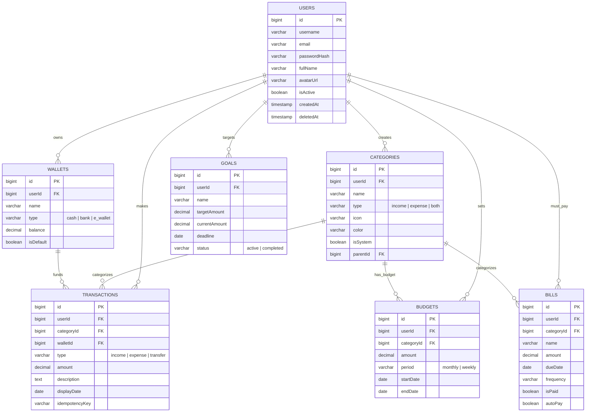

# Database Entity-Relationship Diagram (ERD)

Dưới đây là sơ đồ thực thể liên kết (ERD) được kết xuất từ các tệp Drizzle Schema. Bạn có thể sử dụng các công cụ hỗ trợ Markdown có Mermaid (như GitHub, Notion, Obsidian) để xem bản vẽ trực quan.

## Giải thích Luồng Dữ Liệu:
1. **Users** là trung tâm. Mọi bảng khác đều trỏ về `userId` để đảm bảo data scoping (Cách ly dữ liệu người dùng).
2. **Categories** là bảng từ điển trung tâm (Dictionary Table) kết nối cả `Transactions`, `Budgets` và `Bills`. Điều này giúp ứng dụng có thể tính toán ngân sách (Budget) dựa trên việc đối chiếu (JOIN) với các Giao dịch (Transactions) có chung `categoryId`.
3. **Wallets** là nơi dòng tiền thực tế dịch chuyển. Bất kỳ `Transaction` nào mang tính chất `income` hoặc `expense` đều làm thay đổi `balance` của `Wallets` tương ứng.
4. Hệ thống **không dùng DELETE cứng**. Mọi bảng đều có trường `deletedAt` để áp dụng Soft-Delete.
