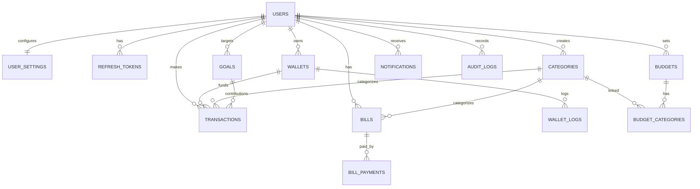

````markdown
# Finance Tracker V3 — Final Project Report

## Team Information

|                       |                                               |
| --------------------- | --------------------------------------------- |
| **Team Name**         | Not specified in repository                    |
| **Project Name**      | Finance Tracker V3                            |
| **GitHub Repository** | https://github.com/tducn110/Tracker_yourMoney |
| **Demo Deploy**       | https://finance-for-me-local.vercel.app       |
| **Video Demo**        | Not specified in repository                   |
| **Submission Date**   | 13/05/2026                                    |

### Team Members

| Full Name      | Student ID       | Role                                                  |
| -------------- | ---------------- | ----------------------------------------------------- |
| Nguyen Tam Duc | Not provided | Team lead / Full-stack developer / architecture / deployment |
| Tran Vo Ba Vuong | Not provided | Frontend / UI refactor / auth flow / route integration |
| Chau Tuan Kiet | Not provided | Backend / financial logic / database integrity / worker automation |

Note: Full name, student ID, and video demo information are not available in the repository history; please confirm before official submission.

---

## Project Overview and Technologies Used

**Application Description:**

Finance Tracker V3 is a personal finance management application following a Budget-First approach. It helps users create budgets by category, record transactions, manage wallets, recurring bills, and savings goals. The application focuses on real-time spending status display, reduces manual data entry with Quick Add/AI parsing, and provides an analytics dashboard to support better spending decisions.

**Tech Stack:**

| Layer           | Technology                                                                                                              |
| --------------- | ----------------------------------------------------------------------------------------------------------------------- |
| Frontend        | Next.js 16.1.4 App Router, React 19.2.5, TypeScript 6.0.3, Tailwind CSS 4.2.4, Radix UI, Lucide React, Motion, Recharts |
| Backend         | Hono 4.12.14, Zod 4.3.6, Firebase Auth/Admin, Jose JWT, Pino logging, Sentry Node (optional)                            |
| Database        | PostgreSQL-compatible database via `drizzle-orm/pg-core`, `pg`, Drizzle Kit; schema and repositories in `packages/db`   |
| Shared Packages | `@finance/api-client`, `@finance/shared-schemas`, `@finance/db`, `@finance/cache`                                       |
| Deploy          | Vercel, Hono embedded in Next.js catch-all API route `apps/web/src/app/api/[[...route]]/route.ts`                       |
| Tooling         | Turborepo 2.9.6, pnpm 9.12.3, ESLint 9, GitNexus code intelligence                                                      |

**Key Features:**

- Dashboard overview with Quick Add, income/expense, budgets, goals, recent transactions, and upcoming bills.
- Budget-First: create, edit, delete, and track budgets by category via `BudgetGrid`, `BudgetOverviewCard`, `BudgetFormModal`.
- Transaction management: list, search, filter by type, sort, CSV import/export, optimistic UI.
- Wallet/account management: multiple wallet types, balance, default wallet, transfer between wallets, wallet audit logs.
- Recurring bill management and bill payment, automatically creating related ledger transactions.
- Savings goal management and contributions toward goals.
- Analytics: spending by category charts and 6-month income/expense trends.
- Auth: Firebase Google login + API session/JWT, route guard on backend.
- Observability: pino structured logging, correlation id, rate limiting, optional Sentry via `SENTRY_DSN`.

**Screenshots to attach before submission:**

- Dashboard: `/`
- Transactions: `/transactions`
- Budgets: `/budgets` and `/budgets/[id]`
- Wallets: `/wallets`
- Goals: `/goals`
- Bills: `/bills`
- Analytics: `/analytics`
- Settings: `/settings`

---

## Setup and Run Instructions

**System Requirements:**

| Tool       | Version                                             |
| ---------- | --------------------------------------------------- |
| Node.js    | >= 18, recommended Node 20+                         |
| pnpm       | 9.12.3                                              |
| Database   | PostgreSQL-compatible database via `DATABASE_URL`   |
| Firebase   | Firebase project for client auth and Firebase Admin |
| Vercel CLI | Optional, used for deployment                       |

**Setup Steps:**

```bash
# 1. Clone repository
git clone https://github.com/tducn110/Tracker_yourMoney.git
cd Tracker_yourMoney

# 2. Install dependencies
pnpm install

# 3. Configure environment
cp .env.example .env
# Fill in DATABASE_URL, JWT_SECRET, Firebase client/admin keys, AI_API_KEY if using AI Quick Add.

# 4. Generate / update database schema in dev environment
pnpm db:generate
pnpm db:push

# 5. Run application locally
pnpm dev

# 6. Quality check commands
pnpm lint
pnpm typecheck
pnpm test
pnpm build
```
````

**Configuration Notes:**

- Local dev: Next.js web and Hono API run via Turborepo; API backend default port `3001`.
- Production/Vercel: `apps/web/src/app/api/[[...route]]/route.ts` delegates all `/api/*` requests to Hono app using `hono/vercel`, runtime `nodejs`.
- `.env.example` still contains old label "TiDB Serverless", but current code uses `drizzle.config.ts` with `dialect: 'postgresql'` and `pg-core` schema.

---

## Task 1 - Project Planning & Teamwork

### (a) Role Assignment

| Member         | Role                | Responsibilities                                                                                                     |
| -------------- | ------------------- | -------------------------------------------------------------------------------------------------------------------- |
| Nguyen Tam Duc | Leader / Full-stack | Planning, Next.js frontend, Hono backend, Drizzle database, auth, API client, Vercel deploy, hardening and bug fixes |

If this is a multi-member group submission, please add full names, student IDs, and task assignments for each member.

### (b) Wireframe

- **Tool Used:** No Figma/Stitch file found in local repo.
- **Pages Designed/Built in Codebase:**
  - [x] Login
  - [x] Dashboard
  - [x] Transactions
  - [x] Budgets
  - [x] Budget Detail
  - [x] Wallets
  - [x] Goals
  - [x] Bills
  - [x] Analytics
  - [x] Settings

Evidence to add before submission: export wireframes from Figma/Stitch for main screens and add to repo, as the local GitHub currently lacks wireframe files.

### (c) Project Plan

**Milestones synthesized from git history, PR titles, contributors, and repo documents:**

| Milestone                                                          | Deadline / Timeline | Status                                                                                    |
| ------------------------------------------------------------------ | ------------------- | ----------------------------------------------------------------------------------------- |
| Requirements analysis and gap analysis                             | 20/04/2026          | Partial in `doc/ops/checklists/Project Requirements & Implementation Plan.md` |
| Initial framework structure                                         | 22/04/2026          | Started, commit `2dd223e` (`tducn`) |
| Auth migration, budget-first core, wallet and Quick Add foundation  | 25/04/2026          | GitHub PRs #1-#10: `feat(auth)`, `feat(budget)`, `feat(wallet)`, `feat(quick-add)`, `feat(ui)` |
| Documentation reorganization and schema alignment                   | 26/04/2026          | GitHub PR #12, local docs cleanup and schema alignment |
| UI refactor and container-presentational cleanup                    | 27/04/2026          | GitHub PR #13, #16, #18 |
| Phase 1 + Phase 2 release to main                                   | 28/04/2026          | GitHub PR #27, #28, #29, #30, #31, #33 |
| Dashboard localization refactor and API wiring                      | 02/05/2026          | GitHub PR #39, #40, #41, #42, #43, #46, #47, #48, #49, #50, #51, #52, #53, #54, #58, #59, #62, #63, #64 |
| Worker, recurring bills, notifications, settings UI                 | 03/05/2026          | GitHub PR #74, #76, #78, #79, #80, #81, #82, #83, #84, #85, #86, #87, #88, #89, #90, #91, #92 |
| Financial integrity hardening, wallet OCC, audit trails             | 04/05/2026          | GitHub PR #93, #94 |
| API hardening: rate limit, CORS, error response, pino cleanup       | 06/05/2026          | GitHub PR #96-#116, issue-driven hardening across auth, logging, CORS, and error UX |
| Vercel API routing, auth fix, Hono embed in Next.js                 | 09/05/2026          | GitHub PR #139, #144, #145, #146 |
| Category seed and budget form fix                                   | 09/05/2026          | GitHub PR #147, #148 |
| AI Quick Add, dashboard/S2S refactor, wallet analytics              | 11/05/2026          | GitHub PR #149, #150, #151, #152, #153, #154, #155 |
| Type error fix and lockfile sync                                    | 11/05/2026          | GitHub PR #156, #157 |
| Final report and submission assets                                  | 13/05/2026          | Report written; remaining assets still need screenshots, video, wireframes, self-reports |

### (d) GitHub Repository

- **Repository link:** https://github.com/tducn110/Tracker_yourMoney
- **Current local branch:** `main`
- **Remote:** `origin https://github.com/tducn110/Tracker_yourMoney.git`
- **GitNexus index:** `Tracker_yourMoney`, 308 files, 3660 symbols, 5963 relationships, 115 execution flows.
- **Last indexed commit:** `46ada24027a468906f7179176aef38ca31ec6403`

### (e) GitHub Workflow

The team uses the GitHub repository with commit history following Conventional Commits, grouping changes by `feat`, `fix`, `chore`, `docs`, `refactor`. Commit history includes many merge commits from Pull Requests, e.g., PR #157, #156, #154, #152, #150, #144, #139, #129-#136. Major fixes are tied to issue/PR numbers in commit messages, making change tracking and review easier.

Contributors visible in the GitHub history are `tducn110` / `tdu._cn`, `ViccVuongVicc`, `kiet00394-collab`, and `Claude`. The early foundation work is mostly associated with `tducn110` / `tdu._cn`, while later feature hardening and release work is spread across `ViccVuongVicc` and `kiet00394-collab`.

**Example commit messages:**

```text
feat(api,web): implement AI Quick Add with Gemini integration (#150)
feat(web): enhance wallet integration and analytics (#154)
fix(vercel): fix auth and api deployment by embedding Hono as Next.js route (#144)
fix(api): add success:false to 429 rate limit error response (#100)
fix(web): parse JSON error responses and display detailed error messages (#102)
chore: update pnpm-lock.yaml
docs: update implementation plan and backlog tasks
```

Screenshots of commits/PRs should be added from GitHub UI before submission.

---

## Task 2 - Implement User Interface

### (a) Pages Built

| Page          | URL / Route     | Description                                                                                               | Implemented By |
| ------------- | --------------- | --------------------------------------------------------------------------------------------------------- | -------------- |
| Login         | `/login`        | Sign in with Firebase/Google and create API session                                                       | Nguyen Tam Duc |
| Dashboard     | `/`             | Quick Add, income/expense overview, wallets, featured budgets, goals, recent transactions, upcoming bills | Nguyen Tam Duc |
| Transactions  | `/transactions` | Transaction history, search/filter/sort, import/export CSV, pagination/load more                          | Nguyen Tam Duc |
| Budgets       | `/budgets`      | Create/edit/delete budgets, summary strip, active/finished budgets                                        | Nguyen Tam Duc |
| Budget Detail | `/budgets/[id]` | Budget details and chart per budget                                                                       | Nguyen Tam Duc |
| Wallets       | `/wallets`      | Manage multiple wallets, add/edit/delete, set default, transfer money                                     | Nguyen Tam Duc |
| Goals         | `/goals`        | Manage savings goals and contribute to goals                                                              | Nguyen Tam Duc |
| Bills         | `/bills`        | Manage recurring bills and pay bills                                                                      | Nguyen Tam Duc |
| Analytics     | `/analytics`    | Spending by category charts and income/expense trends                                                     | Nguyen Tam Duc |
| Settings      | `/settings`     | User and financial settings                                                                               | Nguyen Tam Duc |
| Dev Guide     | `/dev-guide`    | Internal UI patterns documentation                                                                        | Nguyen Tam Duc |

According to Vercel build log, these routes were built successfully: `/`, `/analytics`, `/bills`, `/budgets`, `/budgets/[id]`, `/dev-guide`, `/goals`, `/login`, `/settings`, `/transactions`, `/wallets`, and dynamic API route `/api/[[...route]]`.

### (b) Tailwind CSS Usage

The project uses Tailwind CSS v4.2.4 with `@tailwindcss/postcss`, component-first UI and utility classes directly in JSX/TSX. The interface follows 8px grid layout, responsive padding `p-4 md:p-6`, max width for dashboard, desktop/mobile grid, dark hero cards, and primary color `#4361ee`.

**Typical utility classes:**

```text
p-4 md:p-6 pb-24 max-w-[1200px] mx-auto space-y-6
grid grid-cols-1 lg:grid-cols-3 gap-4
bg-linear-to-br from-blue-500 to-indigo-600
rounded-xl border border-gray-100 shadow-sm
animate-in fade-in slide-in-from-bottom-4 duration-500
```

### (c) Interactive Features

| Feature                        | Description                                                                                                                  | File / Component                                                                                                                     | Implemented By |
| ------------------------------ | ---------------------------------------------------------------------------------------------------------------------------- | ------------------------------------------------------------------------------------------------------------------------------------ | -------------- |
| Quick Add / AI parsing         | Add transaction quickly by text, call `/api/v1/transactions/quick`, invalidate transactions, budget summary and wallet cache | `apps/web/src/components/quick-add/*`, `apps/api/src/routes/transactions.ts`, `apps/api/src/services/adapters/gemini-nlp-adapter.ts` | Nguyen Tam Duc |
| Budget CRUD                    | Create/edit/delete budget, toast success/error, invalidates `['budgets']` and `['budgets','summary']`                        | `apps/web/src/app/(dashboard)/budgets/page.tsx`, `apps/web/src/_lib/hooks/use-budgets.ts`                                            | Nguyen Tam Duc |
| Transaction search/filter/sort | Search, filter income/expense, sort newest/oldest/amount, group by date                                                      | `apps/web/src/app/(dashboard)/transactions/_components/TransactionsContainer.tsx`                                                    | Nguyen Tam Duc |
| CSV import/export              | Export CSV UTF-8, import CSV via FormData and idempotency key                                                                | `TransactionsContainer.tsx`, `transactionsAPI.importCSV`                                                                             | Nguyen Tam Duc |
| Wallet management              | Add/edit/delete wallet, select icon/color, set default, transfer money                                                       | `apps/web/src/app/(dashboard)/wallets/page.tsx`, `apps/web/src/components/wallet/*`                                                  | Nguyen Tam Duc |
| Bills payment                  | Manage bills and pay bills via `/api/v1/bills/:id/pay`                                                                       | `apps/web/src/app/(dashboard)/bills/*`, `apps/api/src/routes/bills.ts`                                                               | Nguyen Tam Duc |
| Goals contribution             | Contribute to goals, create related transaction                                                                              | `apps/web/src/app/(dashboard)/goals/*`, `apps/api/src/routes/goals.ts`                                                               | Nguyen Tam Duc |
| Analytics charts               | Pie/bar/line charts from category spending and monthly trend                                                                 | `apps/web/src/app/(dashboard)/analytics/*`, `apps/api/src/routes/analytics.ts`                                                       | Nguyen Tam Duc |
| Auth flow                      | Firebase Google provider, session auth, `/api/auth/me`, route guard                                                          | `apps/web/src/app/context/AuthProvider.tsx`, `apps/api/src/routes/auth.ts`                                                           | Nguyen Tam Duc |

### (d) Multi-Device Interface

- [x] Mobile (< 768px): Tailwind mobile-first, sidebar/layout with responsive spacing.
- [x] Tablet (768px - 1024px): uses `md:*` classes for padding/grid.
- [x] Desktop (> 1024px): dashboard uses `lg:grid-cols-3`, max width and multi-column layout.

Evidence to add: screenshots from Chrome DevTools Responsive mode for mobile/tablet/desktop.

---

## Task 3 - Database Integration & Dynamic Content

### (a) Database Design

- **Database system:** PostgreSQL-compatible database per current code (`drizzle.config.ts` dialect `postgresql`, schema using `drizzle-orm/pg-core`).
- **ORM:** Drizzle ORM 0.45.2.
- **Number of tables:** 14 main tables in current schema.

**Table List:**

| Table               | Description                                          | Key Columns                                                                                           |
| ------------------- | ---------------------------------------------------- | ----------------------------------------------------------------------------------------------------- |
| `users`             | User account, Firebase/social login and profile info | `id`, `username`, `email`, `firebaseUid`, `fullName`, `isActive`, `deletedAt`                         |
| `user_settings`     | User financial and notification settings             | `userId`, `monthlyBudget`, `currency`, `timezone`, `theme`                                            |
| `refresh_tokens`    | Refresh token/session management                     | `id`, `userId`, `tokenHash`, `expiresAt`, `revokedAt`                                                 |
| `categories`        | Income/expense categories, system and user-defined   | `id`, `userId`, `name`, `type`, `icon`, `color`                                                       |
| `transactions`      | Core ledger table for income/expense/transfer        | `id`, `userId`, `walletId`, `categoryId`, `goalId`, `amount`, `type`, `displayDate`, `idempotencyKey` |
| `wallets`           | User’s multiple wallets/accounts                     | `id`, `userId`, `name`, `type`, `balance`, `initialBalance`, `isDefault`                              |
| `wallet_logs`       | Audit trail of wallet balance changes                | `id`, `walletId`, `userId`, `transactionId`, `balanceBefore`, `balanceAfter`, `difference`            |
| `budgets`           | Budgets by time period                               | `id`, `userId`, `name`, `targetAmount`, `periodType`, `startDate`, `endDate`, `status`                |
| `budget_categories` | Link budget with categories                          | `id`, `budgetId`, `categoryId`, `allocatedAmount`                                                     |
| `goals`             | Savings goals                                        | `id`, `userId`, `name`, `targetAmount`, `currentSaved`, `deadline`, `status`                          |
| `bills`             | Recurring bills/expenses                             | `id`, `userId`, `categoryId`, `name`, `amount`, `dueDay`, `frequency`, `autoPay`                      |
| `bill_payments`     | Bill payment history                                 | `id`, `billId`, `userId`, `periodMonth`, `amountPaid`, `paidAt`, `idempotencyKey`                     |
| `notifications`     | In-app notifications                                 | `id`, `userId`, `type`, `title`, `body`, `isRead`, `metadata`                                         |
| `audit_logs`        | Log of important actions                             | `id`, `userId`, `action`, `entityType`, `entityId`, `metadata`                                        |

**ER Diagram (Mermaid):**



ERD file exists: `doc/wiki/erd.md`.

### (b) Database Connection

- **Server-side technology:** Hono REST API in `apps/api`.
- **Connection method:** frontend calls typed API client `@finance/api-client`; API route validates with Zod, processes business logic in service layer, calls repository in `packages/db`, then queries DB via Drizzle ORM.
- **Production routing:** Next.js catch-all `/api/[[...route]]` embeds Hono app on Vercel.
- **CRUD operations implemented:**
  - [x] Create
  - [x] Read
  - [x] Update
  - [x] Delete

**Connection architecture:**

```text
User UI
  -> React Component / TanStack Query
  -> @finance/api-client
  -> /api/* Next.js catch-all or local Hono server
  -> Hono route + Zod validation
  -> Service layer
  -> Repository layer
  -> Drizzle ORM
  -> PostgreSQL-compatible database
```

### (c) Pages Displaying Dynamic Data

| Page          | Data Displayed                                                                                 | Query / Endpoint                                                                    | Implemented By |
| ------------- | ---------------------------------------------------------------------------------------------- | ----------------------------------------------------------------------------------- | -------------- |
| Dashboard     | Quick add result, overview summary, budget summary, goals, recent transactions, upcoming bills | `/api/v1/transactions`, `/api/v1/budgets/summary`, `/api/v1/goals`, `/api/v1/bills` | Nguyen Tam Duc |
| Transactions  | Transactions with pagination/search/filter, CSV import/export                                  | `/api/v1/transactions`, `/api/v1/transactions/import`, `/api/v1/transactions/quick` | Nguyen Tam Duc |
| Budgets       | List, summary, create/update/delete budget                                                     | `/api/v1/budgets`, `/api/v1/budgets/summary`, `/api/v1/budgets/:id`                 | Nguyen Tam Duc |
| Wallets       | Wallet list, balances, transfer, wallet logs indirectly                                        | `/api/v1/wallet`, `/api/v1/wallet/cash`, `/api/v1/wallet/transfer`                  | Nguyen Tam Duc |
| Goals         | List/create/update/delete/contribute goals                                                     | `/api/v1/goals`, `/api/v1/goals/:id/contribute`                                     | Nguyen Tam Duc |
| Bills         | List/create/update/delete/pay bills                                                            | `/api/v1/bills`, `/api/v1/bills/:id/pay`                                            | Nguyen Tam Duc |
| Analytics     | Category spending and monthly trends                                                           | `/api/v1/analytics/category-spending`, `/api/v1/analytics/monthly-trend`            | Nguyen Tam Duc |
| Settings      | User financial settings                                                                        | `/api/v1/user/settings`                                                             | Nguyen Tam Duc |
| Notifications | Notifications and unread count                                                                 | `/api/v1/notifications`, `/api/v1/notifications/unread-count`                       | Nguyen Tam Duc |

---

## Task 4 - Optimization

### (a) Performance Check with Lighthouse

The local repo does not contain Lighthouse results or audit screenshots. Vercel deploy logs show production build compiled successfully with Next.js 16.1.4/Turbopack and generated 12 routes, but Lighthouse scores must be run on the deployed URL before submission.

**Results before optimization:**

| Metric         | Score                                |
| -------------- | ------------------------------------ |
| Performance    | To be added after running Lighthouse |
| Accessibility  | To be added after running Lighthouse |
| Best Practices | To be added after running Lighthouse |
| SEO            | To be added after running Lighthouse |

**Identified issues and fixes:**

| Issue                                                    | Action Taken                                                            |
| -------------------------------------------------------- | ----------------------------------------------------------------------- |
| Lockfile out of sync causing Vercel deploy failure       | Updated `pnpm-lock.yaml`, PR #157                                       |
| API routing on Vercel incompatible with separate backend | Embedded Hono app into Next.js catch-all API route, PR #144             |
| CORS for Vercel subdomains                               | Added dynamic CORS for `*.vercel.app`, PR #96                           |
| API cold start / logging                                 | Removed dead imports, replaced `console.*` with pino structured logging |
| JSON error UX                                            | Parse JSON error response and show message/correlationId clearly        |
| Basic SEO metadata                                       | Root layout has `metadata.title` and `metadata.description`             |

**Results after optimization:**

| Metric         | Score                                                                             |
| -------------- | --------------------------------------------------------------------------------- |
| Performance    | To be added after running Lighthouse on `https://finance-for-me-local.vercel.app` |
| Accessibility  | To be added after running Lighthouse                                              |
| Best Practices | To be added after running Lighthouse                                              |
| SEO            | To be added after running Lighthouse                                              |

Suggested command to generate evidence:

```bash
pnpm build
# After app is deployed and fully functional:
npx lighthouse https://finance-for-me-local.vercel.app --view
```

### (b) Error Monitoring & User Behavior Tracking

**Google Analytics / Firebase Measurement:**

- [ ] No Google Analytics dashboard evidence found in repo.
- **Measurement ID:** `NEXT_PUBLIC_FIREBASE_MEASUREMENT_ID` exists in `.env.example` and `apps/web/src/_lib/firebase.ts`.
- Code only passes `measurementId` to Firebase config; no import/use of `getAnalytics` seen, so tracking dashboard must be added if rubric requires it.

**Sentry (or equivalent):**

- [x] Integrated (optional).
- **Tool used:** Sentry Node.
- **Config:** `SENTRY_DSN` in `.env.example`; package `@sentry/node` in `apps/api/package.json`.
- **Related files:** `apps/api/src/index.ts` imports `./instrument` if `SENTRY_DSN` exists; `apps/api/src/instrument.ts` calls `Sentry.init({ dsn, sendDefaultPii: true, tracesSampleRate: 1.0 })`.
- **Error types monitored:** API/runtime errors in backend Hono/Node, with correlation id and structured pino logs.

---

## Task 5 - UI/UX Peer Review & Evaluation

### (a) Feedback for Other Teams

No peer-review file or GitHub discussion/issue about feedback for other teams in local repo. Peer review evidence must be added before submission.

**Reviewed Team #1:**

- **Team Name / Project:** To be added
- **Project Link:** To be added

| Aspect            | Strengths                        | Suggestions for Improvement      |
| ----------------- | -------------------------------- | -------------------------------- |
| Usability         | To be added after review session | To be added after review session |
| Aesthetics        | To be added after review session | To be added after review session |
| User-Friendliness | To be added after review session | To be added after review session |

**Reviewed Team #2:**

- **Team Name / Project:** To be added
- **Project Link:** To be added

| Aspect            | Strengths                        | Suggestions for Improvement      |
| ----------------- | -------------------------------- | -------------------------------- |
| Usability         | To be added after review session | To be added after review session |
| Aesthetics        | To be added after review session | To be added after review session |
| User-Friendliness | To be added after review session | To be added after review session |

### (b) Handling Feedback from Other Teams

The repo does not contain documentation of feedback received from other teams. UX changes evidenced in commit history include: auth loading state, wallet integration, analytics, detailed error UX, dashboard refactor, category manager, and cash wallet widget.

| Feedback                                    | Source                      | Decision    | Reason / Commit                                                                |
| ------------------------------------------- | --------------------------- | ----------- | ------------------------------------------------------------------------------ |
| Show API errors more clearly                | Internal testing / UX issue | Implemented | `804e27f`, `48aed12` - parse JSON error responses and display detailed message |
| Fix social login race condition             | Internal testing            | Implemented | `1cf5543` - guard AuthProvider social login flow                               |
| Dashboard and wallet need better visibility | Internal iteration          | Implemented | `1439c58` - enhance wallet integration and analytics                           |
| Quick Add needs to be faster                | Internal iteration          | Implemented | `8b3ca4b` - AI Quick Add integration                                           |
| Peer review from other teams                | No evidence                 | To be added | Create `docs/peer-review-feedback.md` or add GitHub issue/discussion link      |

---

## Deliverables Checklist

- [x] **Source code on GitHub** - repository: https://github.com/tducn110/Tracker_yourMoney
- [x] **README.md with overview and setup** - exists with tech stack, setup, QA commands.
- [x] **ERD** - exists at `doc/wiki/erd.md`, Mermaid ERD included in this report.
- [x] **Vercel Deploy** - production alias in log: https://finance-for-me-local.vercel.app
- [ ] **Screenshots of key features** - need to capture and insert into report/README.
- [ ] **Lighthouse screenshots and scores** - need to run on deployed URL.
- [ ] **Video demo on YouTube** - link to be added, max 10 minutes, min 720p, not private.
- [ ] **Wireframes** - need to export from Figma/Stitch and add to repo.
- [ ] **Peer review evidence** - need to add feedback for/from other teams.
- [ ] **Self-Report** - not found in repository; create files in `docs/self-reports/`.

---

## Self-Reports

According to course template, each member must commit a self-report to `docs/self-reports/self-report-[StudentID].md`. The repo currently has no such folder/file.

| Full Name      | Student ID       | Self-Report Link                                                                     |
| -------------- | ---------------- | ------------------------------------------------------------------------------------ |
| Nguyen Tam Duc | Not specified in repository | Need to create `docs/self-reports/self-report-[StudentID].md` and insert GitHub link |

---

## Appendix - Codebase Evidence

**GitNexus Code Intelligence:**

- Repo indexed: `Tracker_yourMoney`
- Path: `/home/tducn/finance-for-me-local`
- Remote: `https://github.com/tducn110/Tracker_yourMoney`
- Stats: 308 files, 3660 symbols, 5963 relationships, 115 execution flows
- Top modules: UI, Services, Repositories, Quick-add, Dashboard, Routes, Budgets, Hooks, Context, Wallet, Middleware

**Main API route map:**

```text
/api/auth
/api/v1/wallet
/api/v1/analytics
/api/v1/transactions
/api/v1/bills
/api/v1/categories
/api/v1/goals
/api/v1/budgets
/api/v1/user
/api/v1/notifications
/api/v1/ai
/api/v1/health
```

**Important source files:**

| File                                                                              | Role                                          |
| --------------------------------------------------------------------------------- | --------------------------------------------- |
| `apps/web/src/app/(dashboard)/page.tsx`                                           | Dashboard layout                              |
| `apps/web/src/app/(dashboard)/transactions/_components/TransactionsContainer.tsx` | Transaction search/filter/sort/import/export  |
| `apps/web/src/app/(dashboard)/budgets/page.tsx`                                   | Budget CRUD UI                                |
| `apps/web/src/app/(dashboard)/wallets/page.tsx`                                   | Wallet management UI                          |
| `apps/web/src/app/api/[[...route]]/route.ts`                                      | Next.js to Hono API bridge on Vercel          |
| `apps/api/src/index.ts`                                                           | Hono app, middleware, routing, error handling |
| `packages/api-client/src/endpoints.ts`                                            | Typed endpoint client                         |
| `packages/db/src/schema/*.ts`                                                     | Drizzle database schema                       |
| `packages/shared-schemas/src/*.ts`                                                | Zod validation schemas                        |
| `doc/wiki/erd.md`                                                                 | ERD Mermaid                                   |
| `vercel_deploy_2.log`                                                             | Evidence of successful deploy                 |

**Recent GitHub/Git commits and PRs:**

```text
159 feat: onboarding wizard 4 buoc - info, wallet, budget, transaction
157 chore: update pnpm-lock.yaml
156 fix(web): resolve type errors and normalize currency formatting
154 feat(web): Wallet Integration & Analytics Improvements
152 feat(api,web): Dashboard & S2S Engine Refactor
150 feat(api,web): AI Quick Add & Gemini Integration
145 [FIX] Fix Vercel deployment: embed Hono API as Next.js catch-all route (#144)
140 [FEAT] Comprehensive System Refactor and Auth Optimization (#129-136)
116 fix: remove broken ignoreCommand and improve error UX (#102)
107 [FIX] Database Standardization & Migration Sync
94 [FIX] Financial logic integrity and PostgreSQL synchronization (#93)
92 [FIX] Worker DB env, Firebase SSR crash, Next.js cache headers, UI/API updates (#91)
90 [FEAT] backend scale & UI tailwind v4 fixes (#87)
88 [FEAT] Backend Scale & Performance (Phase 11-15) and UI Refactoring
86 [FEAT] Automation, Notifications and Settings (Phase 10 & 11) (#54)
83 feat(web): enhance login UI with premium background and loading state (Phase 9) & fix worker tsconfig
82 [FEAT] Frontend Refactor, React-Query, Optimistic Updates (Phases 6-8)
80 feat: complete feature gaps (Phase 5)
79 feat: wire frontend to real APIs (Phase 4)
78 Feature/issue 37 phase 3 locales
76 fix(db): add walletId to transaction schemas and fix type errors (Phase 3)
33 🚀 Release: dev to main (Phase 1 + Phase 2)
31 [FEAT] Phase 1: Schema Database (Drizzle ORM)
29 feat(db): sync database schema to ERD (migration 0012)
27 [FEAT] Phase 1: Schema Database (Drizzle ORM) (#26)
24 [FEAT] Phase 7 - Backend Error Handling Standardization
17 [CHORE] Remove unused placeholder tables: budget_wallets & cash_wallet_logs
12 feat(doc): finalize documentation reorganization and gitignore update
11 [FEAT] Firebase Social Login & Session Cookie Migration
10 [FEAT] Global UI Design Reframing (V3 Aesthetics)
9 feat(quick-add): enhanced quick-add components with NLP and Simple modes
8 feat(wallet): implement multi-wallet management and sync UI
7 feat(auth): complete migration to Firebase Social Login and Session Cookies
6 feat(budget): implement core budget-first infrastructure
5 [FEAT] Global UI Design Reframing (V3 Aesthetics)
```

```

```
