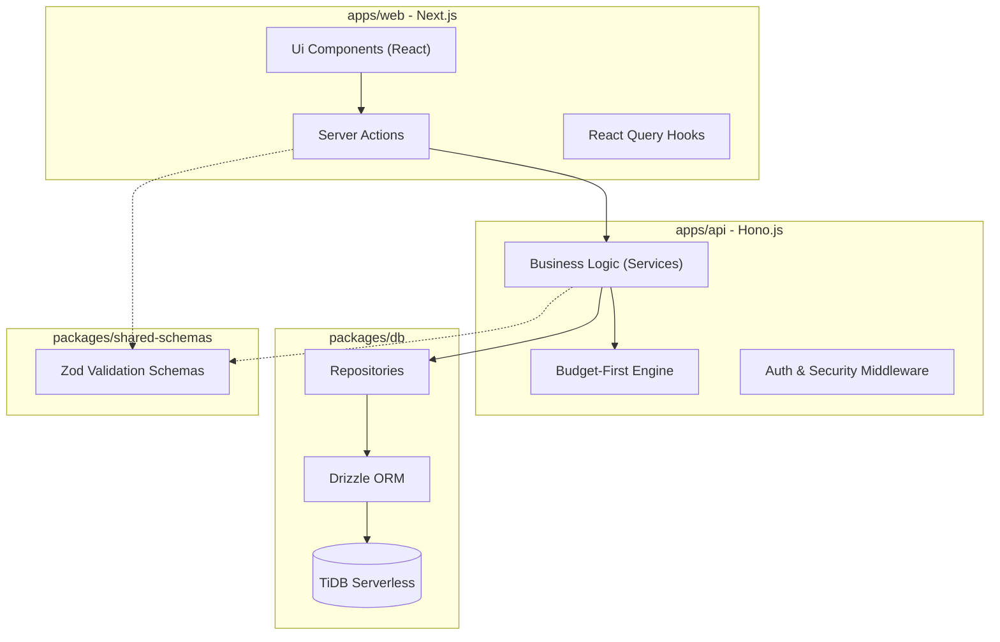

# 🏗️ Finance Tracker V3 System Architecture

This document provides a high-level overview of the Finance Tracker V3 architecture, based on automated analysis from GitNexus.

## 🌟 Overview
Finance Tracker V3 is built as a TypeScript monorepo using **Turborepo**, designed for high performance, financial precision, and a premium user experience.

---

## 🗺️ High-Level Architecture (Mermaid)

---

## 📦 Functional Areas (Clusters)

Based on GitNexus clustering, the codebase is organized into these primary areas:

| Module | Responsibility |
|--------|----------------|
| **Ui** | React components, shadcn/ui, and Framer Motion animations. |
| **Services** | Core business logic, including the Budget Engine and Transaction processing. |
| **Repositories** | Data access layer using Drizzle ORM to interact with TiDB. |
| **Hooks** | TanStack Query hooks for data fetching and state management. |
| **Actions** | Next.js Server Actions for handling form submissions and mutations. |

---

## 🔄 Key Execution Flows (Processes)

### 1. Transaction Creation Flow
`CreateTransactionAction (web)` → `apiFetch (lib)` → `idempotency check (api)` → `TransactionService (api)` → `TransactionRepository (db)`

### 2. Budget Data Display
`DashboardPage (web)` → `useBudgets hook (web)` → `FinanceService (api)` → `BudgetEngine (api)` → `Response (VND formatted)`

### 3. Authentication
`LoginPage (web)` → `AuthAction (web)` → `AuthService (api)` → `JWT Sign (HttpOnly Cookie)`

---

## 🛠️ Tech Stack Decoded
- **Precision:** `Decimal.js` is used across all financial services to prevent floating-point errors.
- **Safety:** Every mutation requires an `Idempotency-Key` and is validated via shared **Zod** schemas.
- **Persistence:** **TiDB Serverless** provides a MySQL-compatible, scalable database layer.

---
*Generated by Antigravity AI via GitNexus Code Intelligence*
