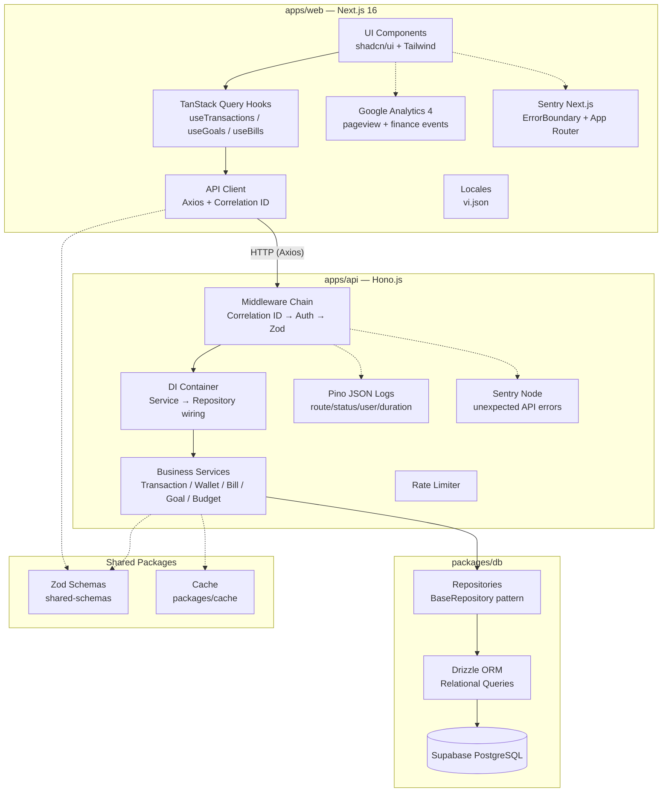

# Finance Tracker V3 — System Architecture

Generated from GitNexus knowledge graph + codebase audit (2026-05-02).

## Overview

Finance Tracker V3 is a TypeScript monorepo (Turborepo + pnpm) for personal finance management.  
Designed for financial precision, data integrity, and premium UX.

**Monorepo packages:**

| Package | Stack | Role |
|---------|-------|------|
| `apps/web` | Next.js 16, TanStack Query, shadcn/ui, Tailwind | User-facing dashboard |
| `apps/api` | Hono.js, Drizzle ORM, Firebase Auth | REST API (port 3001) |
| `apps/worker` | Node.js cron | Background jobs (warm-up, bills) |
| `packages/db` | Drizzle ORM, PostgreSQL/Supabase | Schema, migrations, repositories |
| `packages/api-client` | Axios | Typed HTTP client for frontend |
| `packages/shared-schemas` | Zod | Shared validation schemas |
| `packages/cache` | In-memory | Read-through cache for API |

---

## High-Level Architecture



## Request Lifecycle

```
Browser → [Next.js] → Axios (api-client) → Correlation ID header injected
→ Hono API → correlationId middleware → authMiddleware (Firebase session/JWT)
→ Zod validation (@hono/zod-validator) → Route handler → Service proxy → Service
→ Repository (Drizzle) → PostgreSQL (Supabase)
```

**Middleware chain:** `correlationId` → `authMiddleware` → `zodValidator` → route handler

**Observability flow:** browser pageviews and finance actions emit GA4 events; React/App Router errors are captured by Sentry Next.js; API requests emit Pino JSON logs with correlation ID, route, method, status, user ID, user agent, client IP, and duration; unexpected API errors are captured by Sentry Node with correlation ID and user context.

---

## Functional Areas (GitNexus Clusters)

| Module | Symbols | Cohesion | Description |
|--------|---------|----------|-------------|
| **Services** | 39 | 85% | Business logic: Transaction, Wallet, Bill, Goal, Budget, Auth, Analytics, Category services |
| **Repositories** | 25 | 78% | Data access: TransactionRepo, BillRepo, GoalRepo, CategoryRepo, AnalyticsRepo |
| **Components** | 16 | 94% | React UI: Dashboard cards, QuickAdd forms, Settings, Goals, Bills, Wallets |
| **Hooks** | 13 | 100% | TanStack Query hooks: useTransactions, useGoals, useBills, useWallets, useCategories |
| **Wallets** | 6 | 83% | Wallet management: WalletCard, WalletList, WalletContext |
| **Context** | 5 | 100% | React context providers: AuthProvider, WalletProvider |

---

## Key Execution Flows

### 1. Quick Add Transaction (NLP)

```
QuickAddModal (web) → useQuickAdd hook → transactionsAPI.quickAdd()
→ POST /api/transactions/quick-add
→ TransactionService.quickAdd()
  → NLPAdapter.parse(text) → detects amount, type, keyword
  → CategoryRepository.findAll() → match keyword
  → TransactionRepository.create() → TiDB INSERT
→ Invalidate queries: transactions, budgets, wallet
```

**Trace:** `apps/web/src/components/quick-add/QuickAddModal.tsx`  
→ `apps/web/src/_lib/hooks/finance.tsx` (useQuickAdd)  
→ `packages/api-client/src/endpoints.ts`  
→ `apps/api/src/services/transaction-service.ts`

### 2. Social Login (Firebase)

```
AuthProvider.loginWithGoogle() → Firebase signInWithPopup → getIdToken
→ POST /api/auth/social { idToken }
→ AuthService.socialLogin()
  → verifyFirebaseIdToken() → getAuth().verifyIdToken()
  → upsert user in DB
  → signAccessToken() → signRefreshToken() → set session cookie
→ useLogin hook → invalidate auth.me query
```

**Trace:** `AuthProvider.tsx` → `auth-service.ts` → `firebase-auth.ts` → `jwt.ts`

### 3. Wallet Transfer

```
WalletPage (web) → useTransfer hook → walletAPI.transfer()
→ POST /api/wallets/transfer
→ WalletService.transfer()
  → Validate: different wallets, sufficient balance, positive amount
  → db.transaction():
    → INSERT expense tx (source wallet)
    → INSERT income tx (target wallet)  
    → OCC UPDATE source wallet (WHERE version = ?)
    → OCC UPDATE target wallet (WHERE version = ?)
    → INSERT wallet_logs (audit trail)
→ Invalidate: wallets, transactions
```

**Trace:** `apps/web/src/app/(dashboard)/wallets/`  
→ `apps/api/src/services/wallet-service.ts` (transfer)  
→ `packages/db/src/repositories/transaction.repo.ts`

### 4. Bill Payment

```
BillsContainer → usePayBill hook → billsAPI.pay()
→ POST /api/bills/:id/pay
→ BillService.payBill()
  → Check bill exists + not already paid
  → db.transaction():
    → billPayments INSERT
    → transactions INSERT (source: bill_payment)
→ Invalidate: bills, budgets, wallet
```

**Trace:** `apps/web/src/app/(dashboard)/bills/_components/BillsContainer.tsx`  
→ `apps/api/src/services/bill-service.ts`

### 5. Goal Contribution

```
GoalsContainer → useContributeGoal hook → goalsAPI.contribute()
→ POST /api/goals/:id/contribute
→ GoalService.contributeToGoal()
  → Validate: goal exists, not completed/cancelled
  → db.transaction():
    → goals UPDATE (currentSaved += amount, check if completed)
    → transactions INSERT (source: goal_contribution)
    → If completed: notifications INSERT
→ Optimistic UI: immediate update in cache
→ Invalidate: goals, budgets, wallet
```

**Trace:** `apps/web/src/app/(dashboard)/goals/_components/GoalsContainer.tsx`  
→ `apps/api/src/services/goal-service.ts`

---

## Data Integrity Patterns

### Optimistic Concurrency Control (OCC)
Wallets use a `version` column for safe concurrent balance updates:
```sql
UPDATE wallets 
SET balance = ?, version = version + 1 
WHERE id = ? AND user_id = ? AND version = ?;
-- If affectedRows = 0 → CONFLICT error
```

### Immutable Ledger
Transactions are immutable events. No DELETE endpoint exists.  
To reverse a transaction, create a new reversal entry (opposite type).

### Idempotency
All mutations require `Idempotency-Key` header. Keys stored with UNIQUE constraint.  
Duplicate requests return 409 or cached result — defends against serverless cold-start retries.

### Soft Delete
Financial records use `deleted_at` timestamps. Physical deletion only via internal/teardown routes.

---

## Money Handling

- **Database:** `DECIMAL(15,2)` columns
- **Transport:** JSON strings (never floats)
- **Arithmetic:** `Decimal.js` exclusively
- **Display:** `formatCurrency()` via `Intl.NumberFormat` (vi-VN)

---

## Tech Stack

| Concern | Technology |
|---------|-----------|
| Frontend | Next.js 16, React 19, Tailwind CSS, shadcn/ui |
| State | TanStack Query (server), React Context (auth/wallet) |
| API | Hono.js, Zod validation, jose (JWT) |
| Auth | Firebase Auth (session cookie + Bearer token) |
| Database | Supabase PostgreSQL |
| ORM | Drizzle ORM (relational queries) |
| Precision | Decimal.js |
| Analytics | Google Analytics 4 (`NEXT_PUBLIC_GA_MEASUREMENT_ID`) |
| Logging | Pino structured JSON request/error logs |
| Error tracking | Sentry Next.js + Sentry Node |
| Caching | In-memory (packages/cache) |
| Testing | Vitest (API), Playwright (E2E) |
| Monorepo | Turborepo + pnpm workspaces |

---

## DI Container

All services wired in `apps/api/src/services/container.ts`:

```
Container.initialize(db)
├── CategoryRepository
├── TransactionRepository
├── AnalyticsRepository
├── BillRepository
├── GoalRepository
├── Cache (from @finance/cache)
├── NLPAdapter (RegexNLPAdapter)
├── CategoryService(categoryRepo)
├── TransactionService(txRepo, catRepo, nlp, cache)
├── BudgetService()
├── AIService(nlp)
├── WalletService(catRepo)
├── AnalyticsService()
├── BillService(billRepo, txRepo)
└── GoalService(goalRepo, txRepo, catRepo)
```

Routes use Proxy wrappers that delegate to the container singleton, allowing runtime re-initialization for test isolation.

---

*Generated by Claudex + GitNexus Code Intelligence*
